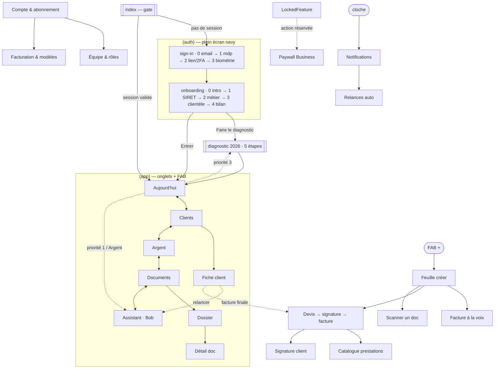

# Carte de navigation — Bob Pro (mobile)

Comment les écrans s'enchaînent, et comment le porter sur **expo-router**. Source de vérité pour l'architecture de navigation. Rendu exact : ouvrir `Bob Pro.dc.html`.

Le prototype est **une seule vue** pilotée par un état : `screen` (l'onglet actif) + `flow`/flags booléens (les surcouches). En React Native, chaque flag devient une **route**. Le tableau §3 fait la correspondance 1:1.

---

## 1. Modèle mental — 3 couches

```
┌─────────────────────────────────────────────┐
│  COUCHE 0 · Hors-app (plein écran, fond navy) │  Auth · Onboarding
├─────────────────────────────────────────────┤
│  COUCHE 1 · App (5 onglets + FAB central)     │  Aujourd'hui · Clients · Argent · Documents · Assistant
├─────────────────────────────────────────────┤
│  COUCHE 2 · Surcouches (au-dessus des onglets)│  feuilles, flux plein écran, paywall, toast
└─────────────────────────────────────────────┘
```

La barre d'onglets et le FAB ne s'affichent QUE en couche 1. Toute surcouche (couche 2) passe **par-dessus** la barre. L'ordre d'empilement suit le `z-index` du proto (§3).

---

## 2. Graphe de navigation



---

## 3. Inventaire complet → routes expo-router

Couche 1 — **onglets** (`(app)/_layout.tsx` = `<Tabs>` + FAB en overlay) :

| Écran | Flag proto | Route | Notes |
|---|---|---|---|
| Aujourd'hui | `screen==='today'` | `(app)/today` | Onglet par défaut. Seul en-tête dégradé. |
| Clients | `screen==='clients'` | `(app)/clients/index` | + filtre B2B/B2C/B2G |
| Fiche client | `showClient` (z65) | `(app)/clients/[id]` | Peut être `card` (pas modal) pour garder l'onglet |
| Argent | `screen==='money'` | `(app)/money` | |
| Documents | `screen==='documents'` | `(app)/documents/index` | |
| Dossier | `showFolder` (z66) | `(app)/documents/[folder]` | |
| Assistant | `screen==='assistant'` | `(app)/assistant` | Teinte IA indigo |

Couche 2 — **surcouches** (routes du stack racine de `(app)`, avec `presentation`). L'ordre `z` du proto = ordre d'empilement :

| Surcouche | Flag proto | z | Route | `presentation` |
|---|---|---|---|---|
| Feuille créer | `showCreate` | 60 | `(modals)/create` | `formSheet` (bottom) |
| Feuille profil | `showProfile` | 60 | `(modals)/profile` | `formSheet` |
| Fiche client | `showClient` | 65 | *(voir couche 1)* | `card` |
| Dossier | `showFolder` | 66 | *(voir couche 1)* | `card` |
| Facture à la voix | `showVoice` | 70 | `(modals)/voice` | `fullScreenModal` |
| Devis→signature→facture | `showDevis` | 70 | `(modals)/devis` | `fullScreenModal` |
| Scanner | `showScan` | 70 | `(modals)/scan` | `fullScreenModal` |
| Nouveau client | `showNewClient` | 71 | `(modals)/new-client` | `formSheet` |
| Notifications | `showNotifs` | 72 | `(modals)/notifications` | `card` |
| Détail document | `showDoc` | 72 | `(modals)/doc/[id]` | `formSheet` |
| Relances auto | `showRelances` | 73 | `(modals)/relances` | `card` |
| Compte & abonnement | `showAccount` | 73 | `(modals)/account` | `card` |
| Facturation & modèles | `showBilling` | 74 | `(modals)/billing` | `card` |
| Équipe & rôles | `showTeam` | 74 | `(modals)/team` | `card` |
| Diagnostic 2026 | `showDiagnostic` | 78 | `(modals)/diagnostic` | `fullScreenModal` |
| Onboarding | `showOnboarding` | 79 | `(auth)/onboarding` | couche 0 |
| Catalogue prestations | `catalogOpen` | 80 | `(modals)/catalogue` | `formSheet` (sur devis) |
| Paywall Business | `paywallOpen` | 80 | `(modals)/paywall` | `transparentModal` |
| Toast | `hasToast` | 85 | *composant global* | pas une route (overlay + Reanimated) |
| Auth | `showAuth` | 90 | `(auth)/sign-in` | couche 0 |

> **Multi-étapes internes** (voice 0-2, devis 0-5, diagnostic 0-4, onboarding 0-4, auth 0-3) : garder en **state local** dans l'écran-flux (pas une route par étape) — c'est un assistant, pas une pile profonde. Le bouton retour recule d'une étape ; à l'étape 0 il ferme la surcouche.

---

## 4. Arborescence expo-router proposée

```
app/
  _layout.tsx              # Root <Stack>. Providers: SafeAreaProvider, ThemeProvider(tokens),
                           # BottomSheetModalProvider, useFonts(Schibsted/Hanken), StatusBar
  index.tsx                # gate → redirect (session ? /today : /sign-in)
  (auth)/
    _layout.tsx            # <Stack headerShown:false>, fond navy, StatusBar light
    sign-in.tsx            # steps 0-3 (state local)
    onboarding.tsx         # steps 0-4, adaptatif métier
  (app)/
    _layout.tsx            # <Tabs> (5) + <Fab/> en overlay absolu
    today.tsx
    money.tsx
    assistant.tsx
    clients/index.tsx
    clients/[id].tsx
    documents/index.tsx
    documents/[folder].tsx
    (modals)/
      _layout.tsx          # <Stack> avec presentation par écran (voir §3)
      create.tsx  voice.tsx  devis.tsx  catalogue.tsx  scan.tsx
      diagnostic.tsx  new-client.tsx  notifications.tsx  relances.tsx
      billing.tsx  account.tsx  team.tsx  paywall.tsx  doc/[id].tsx
components/
  Toast.tsx                # monté haut dans _layout, piloté par un store (Zustand)
```

---

## 5. Deep links (schéma `bobpro://`)

| Lien | Ouvre | Usage |
|---|---|---|
| `bobpro://today` | Aujourd'hui | notification quotidienne |
| `bobpro://clients/:id` | Fiche client | relance / rappel |
| `bobpro://money` | Argent | alerte trésorerie |
| `bobpro://devis/new?client=:id` | Devis composer | raccourci Siri / widget |
| `bobpro://scan` | Scanner | partage d'image entrant |
| `bobpro://diagnostic` | Diagnostic 2026 | campagne conformité |
| `bobpro://invoice/:id/pay` | (web client) lien de paiement | encaissement |

---

## 6. Règles de transition

- **Onglets** : pas d'animation de slide entre onglets (cross-fade instantané), état préservé par onglet.
- **Feuilles** (`formSheet`) : spring depuis le bas, poignée de glisse, fond scrim `rgba(12,35,64,.45)`, dismiss au drag-down.
- **Flux plein écran** (voice/devis/scan/diagnostic) : slide-up modal, bouton fermer (✕) en haut-gauche, jamais de geste back-swipe destructeur sans confirmation si des données sont saisies.
- **Paywall** : `transparentModal`, la carte monte, le fond s'assombrit.
- **Toast** : apparaît à `bottom: 122dp` (au-dessus de la tab bar), auto-dismiss 2,4 s, translateY + opacity (Reanimated).
- **StatusBar** : `light` sur navy (accueil, auth, onboarding, voice, diagnostic), `dark` sur fond clair (autres).
