# User flows — Bob Pro (mobile)

Tous les parcours, écrans et options du proto, en diagrammes + étapes. Chaque étape référence l'**état** interne (`[flag]`) à reproduire et le **résultat attendu**. Ouvrir `Bob Pro.dc.html` pour le rendu de référence.

Convention : `[état]` = valeur d'état interne du proto ; **gras** = ce que voit/fait l'utilisateur. Source de vérité = la maquette + `SCREENS.md` + `NAVIGATION_MAP.md`.

---

## Carte de navigation (vue d'ensemble)

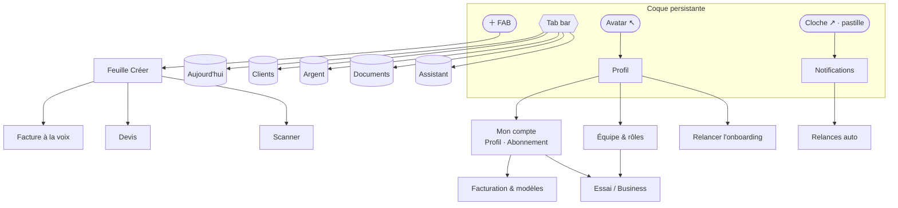

**Coque persistante** (toujours visible sur les 5 onglets) : **avatar** (haut-gauche → Profil), **cloche** (haut-droite, pastille si non-lu → Notifications), **tab bar** 5 onglets, **FAB ＋** central (feuille Créer). Tout le reste s'ouvre en **overlay** empilé au-dessus de l'onglet courant et se referme dessus (on ne perd jamais le contexte).

---

## Inventaire — écrans & options

**Onglets** (`screen`) — `today` · `clients` · `money` · `docs` · `assistant`
**Overlays** (`flow`) — `create` · `voice` · `devis` · `scan` · `client` · `newclient` · `folder` · pièce (`activeDoc`) · `account` · `billing` · `team` · `paywall` · `notifs` · `relances` · `profile` · `auth` · `onboarding` · `diagnostic`

| Écran / overlay | `[flag]` | Options & sous-états |
|---|---|---|
| Aujourd'hui | `screen:today` | carte dispo réel → Argent · priorités (Relancer/Encaisser/Envoyer) · « En un coup d'œil » (4 tuiles → Argent) · actions rapides (Scanner, Encaisser) · bandeau conformité → Diagnostic · coach-mark 1ʳᵉ visite |
| Clients | `screen:clients` | filtres **Tous / B2B / B2C / B2G** · recherche · liste → fiche · ＋ nouveau client |
| Argent | `screen:money` | tréso prédictive (courbe) · **Mise de côté auto** (TVA+charges) toggle · « te verser » · ledger encaissé/à venir · réserves |
| Documents | `screen:docs` | dossiers (Achats, Ventes, Chantiers…) · pièce récente → fiche · Scanner |
| Assistant | `screen:assistant` | chips suggestions · saisie · **cartes d'action** (relance / cash / compta / diagnostic) |
| Feuille Créer | `flow:create` | Facture à la voix · Devis · Scanner · (facture manuelle) |
| Voix | `flow:voice` `voiceStep 0-2` | écoute → facture pré-remplie → **Encaisser** ou **Envoyer** |
| Devis | `flow:devis` `devisStep 0-5` | lignes catégorisées · catalogue · **acompte 30 %** toggle · signature · facture · **situation de travaux** |
| Scan | `flow:scan` `scanStep 0-2` | capture → extraction OCR → auto-classement |
| Fiche client | `flow:client` `clientTab` | activité · pièces · infos · encours · action suivante |
| Nouveau client | `flow:newclient` | **type B2C/B2B/B2G** · nom · email · tél · **SIREN** (si pro) |
| Dossier | `flow:folder` | liste filtrée d'un dossier → fiche pièce |
| Pièce | `activeDoc` | kind **devis/facture/acompte/avoir/situation** · frise e-facture · **Encaisser** · liens (facture/avoir/situation) · PDF |
| Mon compte | `flow:account` `accountTab` | **Profil** · **Abonnement** (essai / 3 offres) · services en plus |
| Facturation | `flow:billing` | régime **franchise/réel** · RIB toggle · mentions/modèles |
| Équipe | `flow:team` | membres · rôles · **Inviter** → paywall |
| Paywall | `paywallOpen` | **essai 14 j** (timeline J0→J12→J14) · Démarrer / Non merci |
| Notifications | `flow:notifs` | liste · tout marquer lu · → Relances auto |
| Relances auto | `flow:relances` | moteur J+7→J+15→mise en demeure · toggle global · ton par palier |
| Profil | `flow:profile` | Mon compte · Équipe · Relancer l'onboarding · Parrainage · Déconnexion |
| Auth | `flow:auth` `authStep 0-3` | login/signup · SSO · mot de passe / Face ID · 2FA |
| Onboarding | `flow:onboarding` `onbStep 0-4` | SIRET · **métier** · **clientèle B2B/B2C/B2G** · bilan |
| Diagnostic | `flow:diagnostic` | score /100 · checklist priorisée 2026 |

---

## Flow 0 — Premier lancement (activation)

Objectif : opérationnel en < 10 min, **prêt e-facturation 2026** dès le départ.

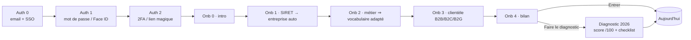

| # | Écran `[flag]` | Utilisateur | Résultat |
|---|---|---|---|
| 1 | Auth `[authStep 0]` | email / SSO, bascule **login↔signup** | passe au mot de passe |
| 2 | Auth `[1]` | mot de passe **ou Face ID** | 2FA ou entrée directe |
| 3 | Onb `[onboarding, onbStep 1]` | saisit SIRET | **Bob remplit** l'entreprise (Mercier Plomberie) |
| 4 | `[onbStep 2]` | choisit **Plombier** | modules adaptés : Chantiers, Acomptes, Retenue de garantie, décennale |
| 5 | `[onbStep 3]` | coche Particuliers + Entreprises | pilote les règles e-invoice (B2C e-reporting / B2B PDP) |
| 6 | `[onbStep 4]` | « Faire le diagnostic » | ouvre le diagnostic, sinon → Aujourd'hui |

**Métier-adaptatif** : l'étape 2 change vocabulaire, modules et checklist conformité. Cœur de la promesse « l'app s'adapte au corps de métier ». Ré-accessible via Profil → *Relancer l'onboarding*.

---

## Flow 1 — Facture à la voix (mission → encaissé)

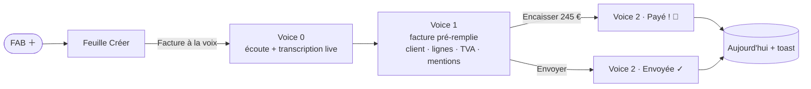

| # | État | Utilisateur | Résultat |
|---|---|---|---|
| 1 | `create` | tape « Facture à la voix » | ouvre l'écoute |
| 2 | `voiceStep 0` | **parle** | transcription live, ondes animées |
| 3 | `voiceStep 1` | relit | facture complète : client, lignes, **TVA + mentions auto** |
| 4 | `voiceStep 2` | **Encaisser** / **Envoyer** | écran succès vert |
| 5 | retour | — | Aujourd'hui, priorité marquée faite, toast |

Valeur : « transformer un travail terminé en argent encaissé, documenté, classé, conforme » — pas « créer une facture ».

---

## Flow 2 — Devis → signature → facture → acompte / situation *(BTP)*

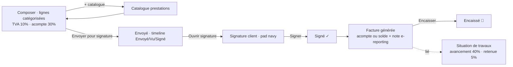

| # | État | Utilisateur | Résultat |
|---|---|---|---|
| 1 | `devis, devisStep 0` | ajoute/édite des lignes (**+ catalogue**) | totaux HT/TTC live, mentions ajoutées |
| 2 | `devisStep 0` | toggle **acompte 30 %** | la facture générée sera un acompte |
| 3 | `devisStep 1` | « Envoyer pour signature » | timeline, « Bob relance sous 3 j » |
| 4 | `devisStep 2` | **signe** sur le pad | bouton « Signer » actif |
| 5 | `devisStep 3-4` | — | facture N° F-… depuis le devis |
| 6 | `devisStep 5` | **Encaisser** / Relancer | succès + toast, retour Aujourd'hui |

**Liens de pièce** : un devis BTP relie sa **facture d'acompte** *et* sa **situation de travaux** (`SIT-2026-041`, avancement 40 %, retenue de garantie 5 % — art. 1799-1). Voir Flow 12.

---

## Flow 3 — Réception & scan d'un document (coffre-fort actif)

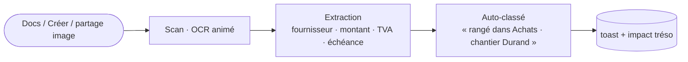

| # | État | Utilisateur | Résultat |
|---|---|---|---|
| 1 | `scan, scanStep 0` | photographie un reçu | OCR balaye l'image |
| 2 | `scanStep 1` | — | montant/TVA/échéance détectés |
| 3 | `scanStep 2` | valide le classement | rattaché client/chantier, envoyé compta, tréso mise à jour |

---

## Flow 4 — Relance (récupérer l'argent sans abîmer la relation)

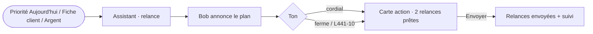

- Entrées multiples convergent vers **Bob** (`screen:assistant`, prompt *relance*).
- **Ton** réglable (cordial → ferme → mise en demeure, mention L441-10 / indemnité 40 €).
- Bob **agit** (prépare + envoie) et renvoie une **carte d'action** — il ne fait pas que répondre.
- **Variante auto** → Flow 14 (`relances`, moteur J+7 → J+15 → mise en demeure).

---

## Flow 5 — Essai gratuit → Business (conversion contextuelle)

Le paywall se déclenche **à l'usage** d'une capacité Business (multi-utilisateurs, multi-banques…), pas dans un menu. Il est **trial-first** : 14 jours offerts, puis 79 €/mois, annulable en 1 tap.

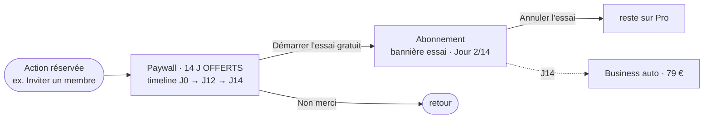

| # | État | Utilisateur | Résultat |
|---|---|---|---|
| 1 | `paywallOpen` | ouvre une capacité Business | paywall : badge **14 jours offerts**, timeline **J0 accès complet → J12 rappel → J14 79 €** |
| 2 | `paywallOpen` | **Démarrer l'essai gratuit** | `trial` actif → écran **Abonnement** (`account/abo`), toast |
| 3 | abo `[trial actif]` | voit la **bannière vivante** | « Essai Business · Jour 2/14 », barre de progression, « tu ne paies rien jusqu'au 16 juil. » |
| 4 | abo | **Annuler l'essai** | `trial:null`, reste sur **Pro**, toast |
| — | — | rien à J14 | auto-conversion **Business 79 €** (annonce honnête, 2 j avant) |

Aussi accessible via la **carte Business** de l'écran Abonnement (« Essayer 14 jours gratuits » → « Essai en cours ✓ »). Offres : **Solo 19 € · Pro 39 € (active) · Business 79 €**.

---

## Flow 6 — Clôture mensuelle comptable

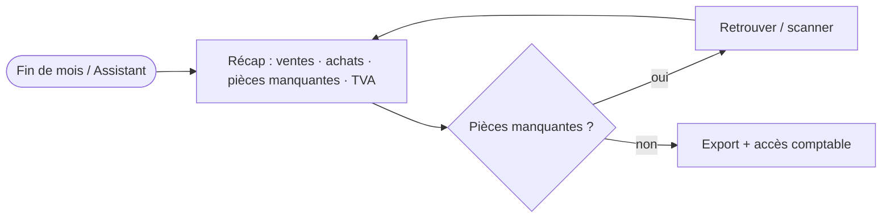

Bob prépare le dossier (« juin prêt : 38 ventes, 17 achats, 2 justificatifs manquants, TVA 1 240 € »), l'utilisateur corrige, le comptable reçoit un flux propre.

---

## Flow 7 — Aujourd'hui (le cockpit du matin)

Répond aux **3 questions** de la journée : que faire ? qui me doit ? suis-je en règle ?

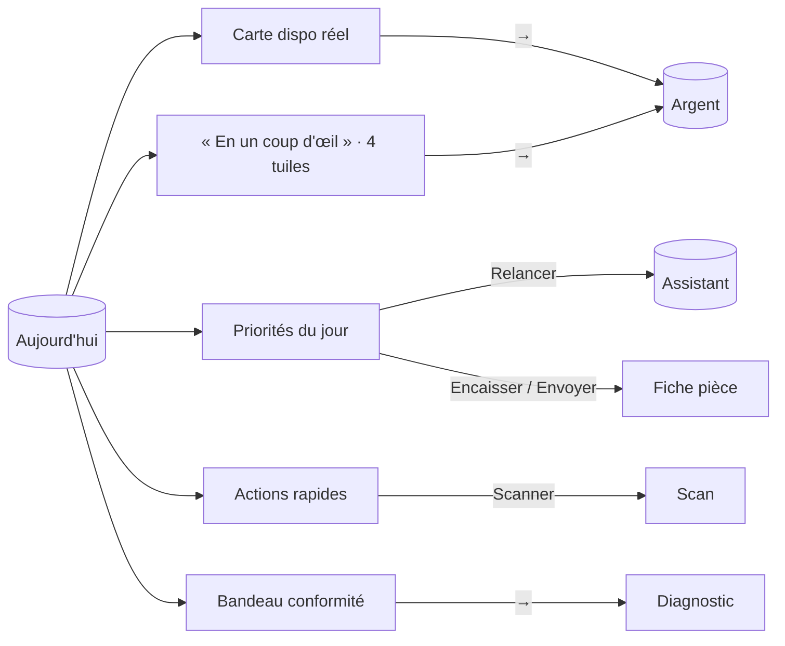

Options : carte **dispo réel** et les 4 tuiles (encaissements, à venir, en retard, solde) ouvrent **Argent** ; les priorités déclenchent la bonne action (relance → Assistant, encaisser/envoyer → pièce) ; **bandeau conformité** → Diagnostic. **Coach-mark** 1ʳᵉ visite (`seenTips.today`).

---

## Flow 8 — Clients (mini-CRM)

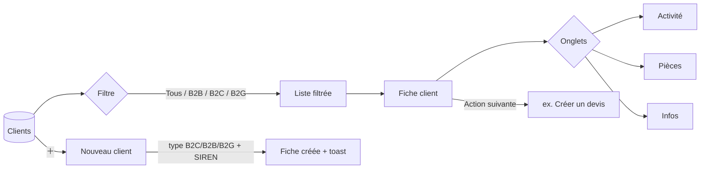

| # | État | Utilisateur | Résultat |
|---|---|---|---|
| 1 | `screen:clients` | choisit un **filtre** B2B/B2C/B2G | liste segmentée (compteur mis à jour) |
| 2 | `flow:client` | ouvre une **fiche** | onglets **Activité / Pièces / Infos**, encours, action suivante |
| 3 | `flow:newclient` | **type** B2C/B2B/B2G, nom, email, tél, **SIREN** (si pro) | client ajouté en tête, fiche ouverte, toast |

Le **type** conditionne les mentions e-facture en aval (B2C e-reporting sans SIREN, B2B/B2G PDP avec SIREN).

---

## Flow 9 — Argent (trésorerie prédictive)

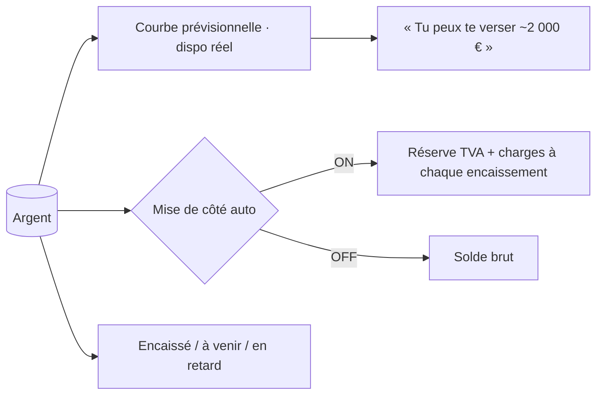

Option maîtresse : **Mise de côté auto** (`toggleReserve`) — réserve TVA + charges à chaque encaissement pour n'afficher que le **vrai dispo**. La courbe distingue *solde brut* et *dispo réel* (« le solde ment »).

---

## Flow 10 — Documents (coffre → dossier → pièce)

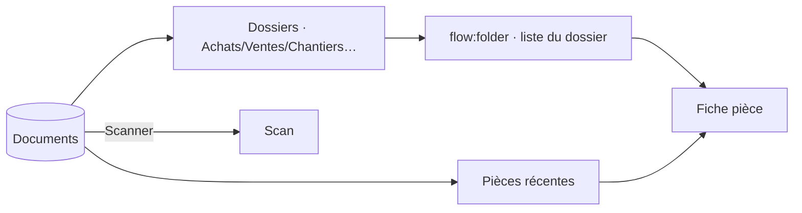

Chaque **dossier** (`flow:folder`) liste ses pièces ; une pièce ouvre la **fiche** (Flow 12). Coach-mark `seenTips.documents`.

---

## Flow 11 — Pièce & cycle de paiement (e-facture 2026)

Vue unique paramétrée par **kind** : devis · facture · acompte · avoir · situation.

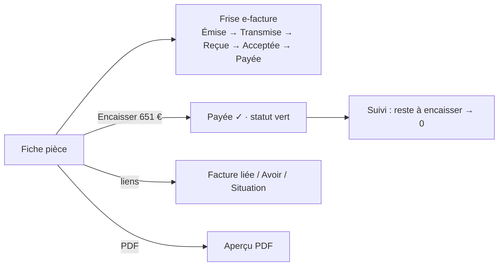

| Élément | Détail |
|---|---|
| **Encaisser** | `primary` sur une facture → `paidPieces[id]=true`, statut **Émise → Payée** (badge vert) partout (header, liste, suivi) |
| **Suivi de paiement** | bloc « Encaissé / Reste à encaisser » → 0 une fois payé |
| **Frise e-facture** | 5 étapes cochées selon `transmission` (PDP pour B2B/B2G, e-reporting pour B2C) |
| **Liens** | `goLinked` (facture↔devis), `goAvoir`, `goSituation` — pièces reliées navigables |
| **B2C vs B2B/B2G** | `partyLine` adaptatif : **B2C sans SIREN** + note e-reporting ; **B2B/B2G avec SIREN** + PDP |
| **Situation** | `SIT-2026-041` : avancement 40 %, retenue de garantie 5 %, pénalités L441-10 |
| **PDF** | `openPdf` → aperçu plein écran |

Coach-mark `seenTips.piece` : « suis ta facture jusqu'au paiement ».

---

## Flow 12 — Compte · Abonnement · Facturation · Équipe

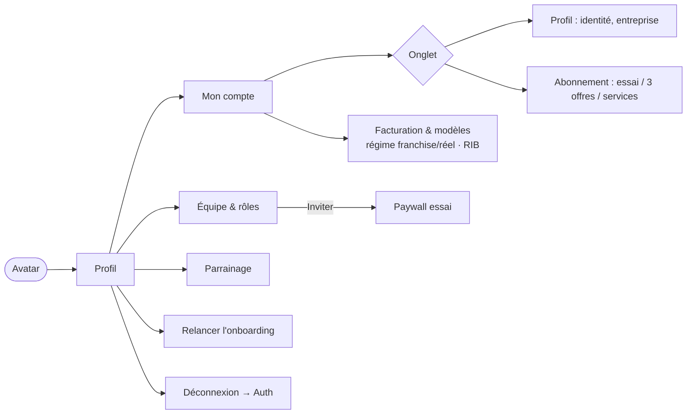

Options : onglet **Profil / Abonnement** (`accountTab`) ; **Facturation** (`billing`) régime **franchise/réel** (`billRegReel`) + **RIB** toggle + modèles ; **Équipe** (`team`) → *Inviter* déclenche le paywall essai (Flow 5) ; **Parrainage** (lien copié) ; **Relancer l'onboarding** ; **Déconnexion** → Auth.

---

## Flow 13 — Notifications & Relances auto

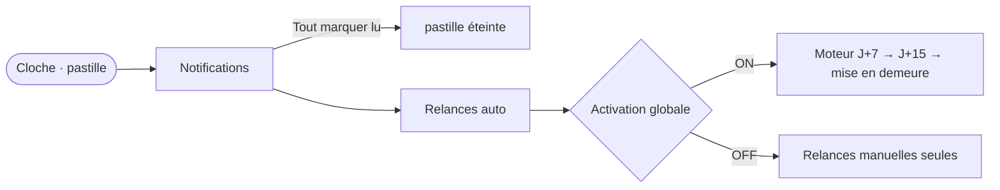

La **cloche** (pastille `notifUnread`) ouvre les Notifications ; *Tout marquer lu* éteint la pastille. De là, **Relances auto** (`relances`) : moteur **J+7 → J+15 → mise en demeure**, activable globalement (`toggleRelancesAuto`), ton réglable par palier.

---

## Flow 14 — Assistant (l'agent qui agit)

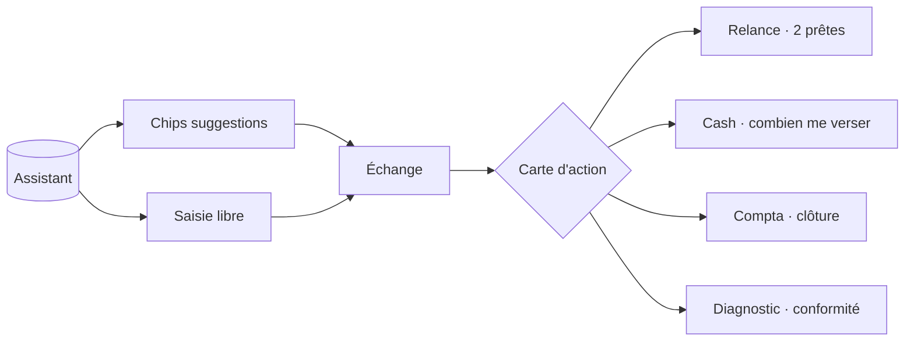

Bob répond **et agit** : chaque intention (relance / cash / compta / diagnostic) rend une **carte d'action** exécutable, pas juste du texte. Coach-mark `seenTips.assistant`.

---

### Principes de flux (transverses)

- **3 questions chaque matin** (Aujourd'hui y répond) : que faire ? qui me doit ? suis-je en règle ?
- **Coach-marks ponctuels** (`seenTips`, une clé par écran : today, clients, money, documents, assistant, piece) — affichés à la 1ʳᵉ visite, jamais répétés.
- **Adaptativité B2B/B2C/B2G** : le type de client pilote partout les mentions e-facture (PDP vs e-reporting, SIREN ou non) et le vocabulaire métier (BTP : acompte, situation, retenue, décennale).
- Les **actions sensibles** (envoyer, relancer, encaisser, mise en demeure, transmettre compta, démarrer l'essai) exigent une **validation humaine** — Bob prépare, l'utilisateur confirme.
- **Retour au contexte** : chaque overlay se referme sur l'onglet d'origine ; les flux « faire » se terminent sur Aujourd'hui avec un toast.
- Prévoir partout : `loading` (skeletons), `empty`, `error` (réseau / OCR), `offline`.
