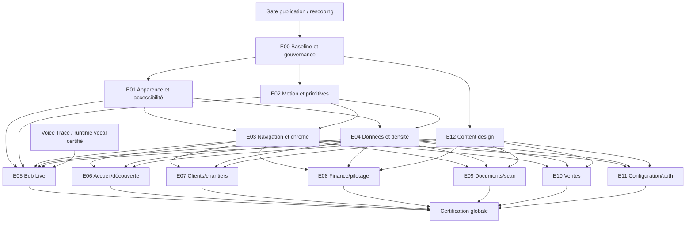

# Roadmap de l'expérience mobile premium

> Statut : **Proposed — non autorisée à implémenter tant que la gate de publication n'est pas levée**
> Unité : cycle de delivery calibré par l'équipe, pas promesse calendaire

Cette roadmap fixe l'ordre et les gates. Le périmètre exact des 77 exigences se lit dans la
[matrice de traçabilité](./15-traceability-matrix.md), le travail exécutable dans le
[backlog](./16-implementation-backlog.md), les critères de sortie dans la
[Definition of Done](./12-definition-of-done.md) et les décisions bloquantes dans le
[registre UX-ADR](./adr/README.md).

## Relation avec le train de publication

Le
[cap fondateur canonique](../../design_handoff_bob_pro/OBJECTIFS_SPECS_DOD_PUBLICATION.md),
`Accepted` et daté du 2026-07-21, impose que publication stable, Factur-X, données réelles et GPT
Realtime passent avant tout ajout opportuniste. Ce document respecte ce cap selon les règles
suivantes :

- la présente roadmap **prépare** le travail post-publication ;
- elle n'autorise aucun big bang UI sur le train courant ;
- un correctif P0 de lisibilité, accessibilité ou faux statut peut être extrait, mais seulement avec
  arbitrage explicite et preuve de non-régression ;
- Bob Live visuel ne doit pas devancer la certification fonctionnelle GPT Realtime/Voice Trace ;
- la vérité provider du train courant vient de
  [l'ADR de publication accepté](../adr/0004-gpt-realtime-publication-mistral-v3-post-v1.md) ;
- après publication, une décision fondateur ou un rescoping formel ouvre la Vague 0.

## Résultat attendu

À la sortie du programme :

- la note audit est au moins 88/100 sans P0/P1 ouvert ;
- chaque mouvement appartient à un système documenté ;
- chaque état visible est dérivé d'une vérité applicative ;
- Bob Live possède une signature visuelle propriétaire et accessible ;
- les 32 routes et l'auth partagent navigation, chrome, press states et contenu cohérents ;
- les performances et SLO voix sont prouvés sur appareils réels ;
- le rollout peut être arrêté par domaine sans rollback global du produit.

## Epics

| Epic | Domaine | Audit couvert | Dépendances principales |
| --- | --- | --- | --- |
| `E00` | Gouvernance, baseline et non-régression | Préparation transverse | Cap publication, claims, captures, métriques |
| `E01` | Apparence adaptative et accessibilité | G01, G02, G03, G19, G22 | E00 |
| `E02` | Architecture motion et primitives | G04, G05, G06, G08, G09, G18, G21 | E00, E01 policy |
| `E03` | Navigation, chrome, sheets et matières | G07, G10, G11, G12, G16, G20 | E01, E02 |
| `E04` | Filtres, listes, données et densité | G13, G14, G15, G17 | E01, E02 |
| `E05` | Bob Live et Assistant | V01–V14, S05, S32 | E01–E04, Voice Trace |
| `E06` | Accueil, recherche, notifications | S01, S06, S07 | E01–E04, E12 |
| `E07` | Clients et chantiers | S02, S08, S09, S10 | E01–E04, E12 |
| `E08` | Argent, dépenses, comptabilité, clôture, pilotage | S03, S18–S21 | E01–E04, E12 |
| `E09` | Documents et scan | S04, S22–S24 | E01–E04, E12 ; E05 seulement pour une interaction voix explicitement incluse |
| `E10` | Ventes, devis, factures, catalogue | S11–S17 | E01–E04, E12 |
| `E11` | Diagnostic, onboarding, compte et auth | S25–S31, S33 | E01–E04, E12 |
| `E12` | Content design et confiance | T01–T08 | E00, contrats d'état |

## Graphe de dépendances

## Vague 0 — Autorisation et baseline

### But

Créer la photographie reproductible, accepter les ADR et rendre le programme découpable sans
risque pour le train publié.

| Élément | Contenu |
| --- | --- |
| Entrée | Release publique terminée ou rescoping fondateur explicite. |
| Livrables | Captures, vidéos, métriques release, matrice route, inventaire composants, ADR acceptés, flags. |
| Work packages | `WP-0001` à `WP-0008` uniquement. `WP-0009` appartient à la Vague 3. |
| Sortie | Baseline signée et environnement de comparaison disponible en CI/QA. |
| Taille | 1–2 cycles. |
| Risque majeur | Commencer à coder avant d'avoir une preuve avant/après. |

Gate d'autorité `GATE-BASELINE` : aucune primitive partagée n'est modifiée avant l'acceptation de
la baseline et des ADR UX structurants. Sa composition WP exacte est définie dans le
[backlog exécutable](./16-implementation-backlog.md#gates-executables).

## Vague 1 — Fondations adaptatives, motion et contenu

### But

Créer les capabilities communes une seule fois avant de toucher les écrans.

| Epic | Livrables de sortie |
| --- | --- |
| E01 | StatusBar adaptative, contrat clair/sombre, Dynamic Type, préférences système, layout adaptatif. |
| E02 | Tokens motion, runtime accepté, press state, haptique, layout transition, états asynchrones. |
| E12 | Glossaire d'états, copy financière, erreurs réparables, textes pérennes et personnalité verrouillée. |

Critères de sortie :

- composants de démonstration sur une galerie isolée ;
- aucune migration massive d'écran ;
- tests Reduce Motion/Transparency et grandes polices ;
- profiling iOS/Android release ;
- migration réversible des composants ;
- contrats de contenu validés avec produit/finance/sécurité.

Taille indicative : 3–5 cycles selon la décision thème sombre et tablette.

## Vague 2 — Navigation, chrome et données

### But

Donner une continuité native à l'app sans modifier encore les parcours métier complexes.

| Epic | Livrables de sortie |
| --- | --- |
| E03 | Taxonomie route, headers, tabs, sheets, recherche, scroll et matériaux. |
| E04 | Filtres, listes, transitions de données, graphiques et progressive disclosure. |

Pilotes techniques obligatoires :

1. une route push simple avec geste Retour ;
2. une sheet formulaire avec clavier et lecteur d'écran ;
3. une tab avec retap scroll-to-top ;
4. une longue liste avec insertion/suppression ;
5. un changement de montant exact et accessible ;
6. un fallback sans verre, zoom ni haptique.

Gate d'autorité `GATE-NAV-DATA` : aucune migration des écrans transactionnels avant preuve que
navigation, clavier, deep links et performance ne régressent pas.

Taille indicative : 3–4 cycles.

## Vague 3 — Pilote premium Bob

### But

Prouver l'ambition sur un slice à haute valeur avant de généraliser.

Ordre :

1. machine visuelle Bob Live et projection d'états ;
2. overlay global ;
3. Assistant et auto-scroll ;
4. Aujourd'hui comme page de causalité ;
5. Documents comme preuve de relocalisation.

`Aujourd'hui` et `Documents` ne sont ici que des slices pilotes bornées, derrière flags, destinées à
éprouver les primitives et Bob en contexte réel. Leur epic écran ne passe pas à `Verified` dans
cette vague ; la migration de tous leurs états et parcours est fermée en Vague 4.

Le work package de certification de cette vague est **`WP-0009`**, jamais un livrable de Vague 0.
Son périmètre est figé : `S05 Assistant + overlay Bob`, `S01 Aujourd'hui` comme écran de données et
un scénario borné `S04 document validé → classement confirmé`. Il ne démarre qu'après les gates
`GATE-FOUNDATION`, `GATE-NAV-DATA` et `GATE-BOB-PILOT` définies dans le backlog.

Critères de sortie :

- amplitude réellement issue du pipeline audio, sans stockage supplémentaire ;
- connexion, écoute, silence, réflexion, outil, parole, interruption, reconnexion et erreur distincts ;
- SLO voix inchangés ou améliorés ;
- transcript, captions, Stop et fallback texte accessibles ;
- aucun état inventé ;
- vidéo validée sur iPhone et Android médian ;
- variant Reduced Motion complet ;
- kill switch permettant de revenir à la surface actuelle.

Taille indicative : 4–7 cycles, dépendante de la disponibilité des événements Voice Trace et du
pipeline d'amplitude.

## Vague 4 — Parcours quotidiens

### But

Étendre les fondations aux consultations fréquentes, moins risquées que les flux d'émission.

| Ordre | Domaine | Écrans |
| ---: | --- | --- |
| 1 | Accueil/découverte | Aujourd'hui, Recherche, Notifications |
| 2 | Clients | Clients, Fiche client |
| 3 | Chantiers | Chantiers, Détail chantier |
| 4 | Documents | Documents, Dossier, Détail document |

Chaque écran est livré verticalement : états, motion, copy, accessibilité, performance, analytics,
capture et rollback. Une migration d'écran ne bloque pas les autres onglets.

Taille indicative : 4–6 cycles.

## Vague 5 — Parcours transactionnels et financiers

### But

Appliquer la continuité aux flux à fort risque sans toucher à leur autorité métier.

Ordre recommandé :

1. Ventes et Catalogue ;
2. Détail devis/facture et transmission ;
3. Nouvelle facture ;
4. Nouveau devis ;
5. Argent et Dépenses ;
6. Comptabilité, Clôture et Pilotage ;
7. Scan, après calibration du pipeline réel.

Critères locaux obligatoires de clôture financière pour chaque slice — ils complètent la DoD et ne
constituent pas une gate d'ordonnancement distincte :

- montants finaux strictement identiques avant/après ;
- aucune animation utilisée comme calcul ;
- succès seulement après relecture ou ACK autoritaire ;
- double soumission et reprise réseau testées ;
- confirmation sensible inchangée ;
- capture des cas échec, timeout, conflit de révision et offline ;
- revue métier dédiée.

Taille indicative : 6–10 cycles.

## Vague 6 — Configuration, accès et adaptation large

### But

Fermer les écrans secondaires, les parcours ponctuels et les compositions tablette.

Périmètre : Diagnostic, Onboarding, Compte, Réglages facturation, Profil fiscal, Callback,
Récupération, Connexion/inscription, route voix historique et layouts iPad/split view.

Taille indicative : 3–5 cycles.

## Vague 7 — Certification et rollout général

### But

Prouver l'expérience comme un système complet et non une collection de composants.

Le work package parent de fermeture est `WP-0010`. Son enfant `WP-0010-01` conduit R0→R3 après
`GATE-ROLLOUT-READY`; il produit la preuve autorisant `GATE-GLOBAL`. L'enfant `WP-0010-02` conduit
ensuite R4, la surveillance post-déploiement et l'archivage final. Le parent agrège le registre de
preuves et les décisions de rollout ; il ne réexécute pas silencieusement les validations de
chaque slice.

| Gate | Preuve binaire |
| --- | --- |
| Fonctionnel | Suites ciblées et globales vertes, données réelles, zéro faux succès. |
| Design | Revue pixel/motion sur appareils, captures approuvées. |
| Accessibilité | Matrice complète VoiceOver/TalkBack et préférences système. |
| Performance | Budgets de frame, mémoire, batterie et SLO voix tenus. |
| Compatibilité | OS minimum, médian, latest, petits/grands écrans et tablette. |
| Observabilité | Dashboards et alertes sans PII. |
| Rollback | Flags et runbook testés en staging. |
| Produit | Note ré-audit ≥ 88/100, aucun P0/P1 ouvert. |

Taille indicative : 2–4 cycles, hors correction des écarts.

## Stratégie de rollout

| Ring | Audience | Durée minimale | Conditions de progression |
| --- | --- | --- | --- |
| R0 | Développeurs/design/QA | Jusqu'à fermeture des tests | Aucun crash, parcours principaux terminés. |
| R1 | Interne appareils réels | ≥ 3 jours utiles | Performance et accessibilité sans P0. |
| R2 | Bêta fermée ≤ 5 % | ≥ 7 jours | Pas de hausse crash/erreur, retours qualitatifs stables. |
| R3 | 25 % éligibles | ≥ 7 jours | Budgets et funnels non dégradés. |
| R4 | 100 % éligibles | Après revue finale | Rollback toujours disponible pendant une fenêtre définie. |

Les pourcentages et durées sont des minima proposés. Le responsable release peut prolonger un ring,
jamais le raccourcir sans décision écrite et preuve compensatoire.

## Scénarios de capacité

Les tailles précédentes sont relatives. Le calendrier réel doit être recalibré après Vague 0.

| Équipe | Ordre de grandeur indicatif | Contrainte |
| --- | --- | --- |
| 1 mobile senior + support design/QA partiel | 24–36 semaines | Peu de parallélisme, risques de contexte et QA tardive. |
| 2 mobile + design produit + QA partagé | 14–22 semaines | Recommandé pour primitives puis slices parallèles non chevauchants. |
| 3 mobile spécialisés + design/motion + QA/a11y | 10–16 semaines | Exige gouvernance stricte, ownership de composants et intégration fréquente. |

Ces plages ne comprennent pas les délais d'arbitrage, de provider, de store ou de correction d'un
problème backend révélé par la nouvelle UI.

## Règles de parallélisation

- Une seule équipe possède une primitive partagée à un instant donné.
- Les écrans ne commencent pas avant stabilisation de la primitive dont ils dépendent.
- Bob Live visuel et runtime vocal ont des owners distincts mais un contrat d'événements gelé.
- Deux slices financières partageant `PieceDetailView`, `DocumentActions` ou le draft ne sont pas
  modifiées en parallèle sans handoff explicite.
- Les tests et captures sont livrés dans la même tranche que l'écran.
- Les branches restent courtes et n'accumulent pas plusieurs vagues.

## Stop conditions

Le programme ou un rollout s'arrête immédiatement si :

- un succès visuel précède un succès autoritaire ;
- une action est exécutée deux fois ;
- le geste Retour, un deep link ou la restauration est cassé ;
- la latence vocale p95 dépasse le budget ou l'audio subit des glitches ;
- un mode accessibilité perd une information ou une action ;
- une animation crée un freeze, une chute soutenue de frames ou une surchauffe ;
- une matière rend du texte illisible ;
- un changement implique un contrat backend non spécifié ;
- le rollback n'est pas démontré.

## Définition de réussite de la roadmap

La roadmap est réussie lorsqu'elle peut être arrêtée après n'importe quelle vague en laissant une
application cohérente, testée et publiable. Le programme n'exige jamais d'achever toutes les vagues
pour restaurer la stabilité.
