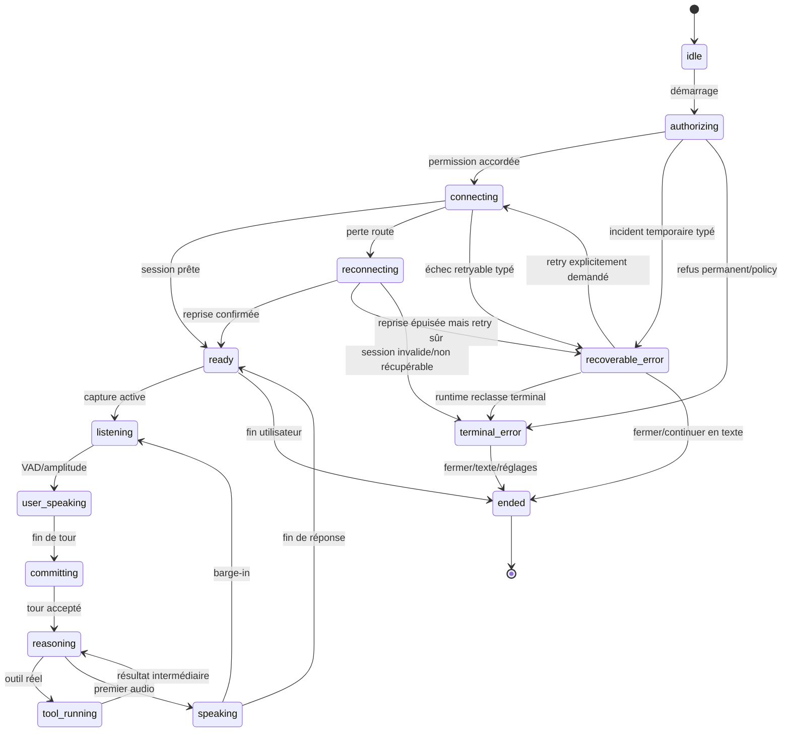

# Spécification d'expérience Bob Live

> Statut : **Proposed — dépend de la certification runtime du train de publication**
> IDs liés : V01–V14, S05, S32, T01, T06, T08
> Autorité : couche de présentation provider-neutral ; ne redéfinit pas le transport ni l'autorité métier

## Objectif

Donner à Bob une présence visuelle propriétaire, vraie et accessible, sans ralentir la voix ni
dupliquer la machine de session. Le train de publication actuel priorise GPT Realtime ; cette spec
reste provider-neutral et se branche sur les événements canoniques réellement disponibles.

## Invariants hérités

- Les SLO voix-à-voix et interruption existants priment sur le visuel.
- Aucun montant n'est improvisé ; les faits viennent des outils.
- Toute mutation sensible conserve confirmation et audit.
- Une session ne bascule pas silencieusement de provider.
- Une perte réseau ne devient jamais succès.
- La voix et le toucher résolvent la même interaction typée lorsque la parité est prévue.
- Aucun audio brut, transcript ou PII n'entre dans la télémétrie visuelle.
- Un seul overlay Bob global est visible.

## Signature

La signature est un **ruban/membrane Bob** : noyau indigo, lumière lavande, contour souple et faible
profondeur. Elle existe sous trois formes reliées :

1. `control` : bouton micro/Bob compact ;
2. `capsule` : état bref avec label et Stop ;
3. `card` : transcript, réponse, choix ou erreur.

Le même objet morph entre ces formes. Le vert reste réservé au succès, l'ambre à la récupération et
le rouge à l'erreur. `speaking` n'est pas vert par défaut.

## Machine visuelle



L'implémentation peut avoir davantage d'états runtime. La projection visuelle ne fusionne deux
états que si elle ne perd pas une information utile ou ne produit pas un mensonge.

## Contrat d'état proposé

```ts
type BobVisualPhase =
  | 'idle'
  | 'authorizing'
  | 'connecting'
  | 'ready'
  | 'listening'
  | 'user_speaking'
  | 'committing'
  | 'reasoning'
  | 'tool_running'
  | 'speaking'
  | 'reconnecting'
  | 'recoverable_error'
  | 'terminal_error'
  | 'ended';

interface BobVisualState {
  phase: BobVisualPhase;
  sessionId?: string;
  turnId?: string;
  contextLabel?: string;
  truthfulStatusKey: string;
  transcriptPreview?: string;
  responsePreview?: string;
  toolLabelKey?: string;
  canStop: boolean;
  canRetry: boolean;
  canContinueInText: boolean;
  amplitude01?: number;
  generation: number;
}
```

Ce contrat appartient à la présentation mobile. Il consomme les événements du runtime ; il ne
devient ni un état métier dans `packages/core`, ni une nouvelle autorité de session.

## Contrat de classification des erreurs

La projection visuelle ne déduit jamais la récupérabilité depuis un message, un code fournisseur ou
un timer. L'adapter runtime publie un événement canonique avec au minimum :

```ts
type BobRecoveryClass = 'retryable' | 'terminal';

interface BobRuntimeFailure {
  failureKind: string; // enum canonique, jamais texte fournisseur affiché
  recoveryClass: BobRecoveryClass;
  safeAction: 'retry' | 'open_settings' | 'continue_text' | 'close' | 'support';
  generation: number;
}
```

- `recoverable_error` exige `recoveryClass: retryable` et une relance explicitement sûre/idempotente.
- `terminal_error` signifie que **la session courante** ne peut pas reprendre : permission bloquée,
  authentification/session invalide, capability absente ou classification manquante.
- Une erreur non classée échoue donc en `terminal_error` pour la session, avec fallback texte ; l'UI
  n'invente jamais un retry.
- Seul un nouvel événement runtime peut faire sortir de l'erreur. Un tap demande l'action ; il ne
  change pas localement la phase en `ready` ou `connecting`.
- Le texte utilisateur vient du dictionnaire canonique `failureKind → copy/action`, sans exposer le
  provider. La génération protège des erreurs tardives d'une ancienne session.
- Un résultat outil dont l'autorité est inconnue reste `unknown` dans la carte d'action ; il ne doit
  pas être confondu avec une panne terminale de la session vocale.

## Table d'états

| Phase | Source minimale | Visuel | Texte type | Actions | Accessibilité |
| --- | --- | --- | --- | --- | --- |
| Idle | Aucune session active. | Noyau calme, immobile. | « Parler à Bob » | Activer. | Bouton, état inactif. |
| Authorizing | Demande permission réellement ouverte. | Expansion unique, pas d'onde. | « Ouverture du micro… » | Annuler. | Annonce unique. |
| Connecting | Transport/session en ouverture. | Trait périmétrique lent. | « Connexion sécurisée… » | Annuler. | Progressbar indéterminée. |
| Ready | Session prête, capture pas encore active. | Capsule stable. | « Bob est prêt » | Écouter/fermer. | État prêt annoncé une fois. |
| Listening | Capture active et permission acquise. | Membrane basse amplitude. | « Je vous écoute… » | Stop. | Label + transcript live region bornée. |
| User speaking | VAD/amplitude réelle. | 8–12 segments/membrane réactive. | « Je vous écoute… » | Stop. | Pas d'annonce par VAD. |
| Committing | Fin de parole envoyée/acceptée. | Membrane se resserre. | « J'ai bien reçu » seulement si ACK ; sinon « Envoi… ». | Annuler si permis. | Annonce d'état, pas de succès. |
| Reasoning | Raisonnement réel en cours. | Noyau calme/orbite contenue. | « Je vérifie… » ou phase vraie. | Stop. | Progression vraie ou indéterminée. |
| Tool running | Outil identifié. | Ticks discrets + carte concernée. | « Vérification de la facture… » | Stop/voir. | Nom de l'outil vulgarisé. |
| Speaking | Playback effectivement actif. | Onde sortante liée au niveau audio. | « Bob répond » + captions. | Interrompre/Stop. | Captions et contrôle accessible. |
| Reconnecting | Reprise transport réelle. | Arc interrompu, ambre. | « Reconnexion… » | Annuler, texte. | Annonce unique, délai indiqué si utile. |
| Recoverable error | Session récupérable. | Forme stable ambre, symbole. | Cause + impact + « Réessayer ». | Retry/texte. | Focus sur message, pas de couleur seule. |
| Terminal error | Session inutilisable. | Forme stable rouge, sans boucle. | Cause sûre + prochaine action. | Fermer/texte/support. | Notification error une fois. |
| Ended | Fermeture confirmée. | Repli vers l'ancre. | Dernière réponse conservée. | Réouvrir. | Focus revient au déclencheur. |

## Amplitude audio

### Entrée utilisateur

- Source : niveau fourni par la capture native ou un port métrique éphémère.
- Normalisation : 0–1, sans audio brut.
- Lissage indicatif : attack ~60 ms, release ~180 ms.
- Fréquence de rendu : adaptée à l'appareil, 30–60 fps ; jamais un event React par échantillon.
- Excursion visuelle : ±8–12 % maximum.
- 8–12 segments ou une membrane ; deux halos maximum.
- Niveau de bruit calibré ; pas de jitter lorsque l'utilisateur se tait.
- Aucune persistance, analytics ou log de l'amplitude fine.

### Sortie Bob

- Source distincte liée au playback réel.
- Direction visuelle sortante.
- Si l'amplitude de sortie n'est pas disponible, utiliser une animation de parole bornée, jamais la
  même que l'écoute, et documenter cette dégradation.
- L'état s'arrête lorsque le player est silencieux, pas à la fin du texte logique.

## Silence

Après environ 600–900 ms sans parole :

- amplitude se calme ;
- label d'écoute demeure ;
- aucun countdown agressif ;
- si une limite réelle approche, l'annoncer avec une action ;
- aucune transition vers `reasoning` sans commit réel.

## Barge-in

1. VAD utilisateur ou geste Stop reconnu.
2. Le playback est arrêté selon le runtime canonique.
3. Le visuel inverse immédiatement sa direction et se resserre.
4. `speaking` ne disparaît définitivement qu'avec l'état runtime correspondant.
5. Le transcript de la nouvelle parole démarre dans le même tour/session selon le protocole.

Budget visuel : retour perceptible vers l'écoute < 100 ms. Le budget audio reste celui de la spec
Bob Live et ne peut pas être dégradé pour synchroniser un morph.

## Transcript et captions

- Transcript partiel visible sous l'état, limité à quelques lignes dans la capsule.
- Historique complet dans le chat, pas dans l'overlay compact.
- Mise à jour par segments significatifs, pas par caractère.
- Aucun auto-scroll si l'utilisateur relit plus haut.
- Captions de Bob disponibles pendant la parole.
- Correction/édition uniquement si le produit l'autorise avant finalisation ; ne pas suggérer une
  éditabilité inexistante.
- Le lecteur d'écran reçoit des mises à jour regroupées et non chaque delta.

## Reasoning et outils

- Interdit : phrases décoratives cycliques « Je comprends / J'agis » sans source.
- Recommandé : nom métier vulgarisé d'un outil réellement en cours.
- Un outil long peut mettre à jour la carte concernée plutôt que l'orb seule.
- Une proposition n'est pas un succès.
- Une confirmation affiche le diff et les conséquences, avec même identifiant voix/tap.
- Après confirmation, `pending` persiste jusqu'à l'ACK/relecture.

## Overlay global

- Ancre stable et non obstructive, calculée avec safe area, clavier et tab bar.
- Morph `control → capsule → card`.
- Carte : état, contexte, transcript/réponse, action primaire et Stop.
- Une seule surface Bob ; aucune copie sur un écran qui possède déjà l'overlay global.
- La fermeture replie vers le déclencheur et conserve la dernière réponse dans l'Assistant.
- Le passage d'écran conserve la mission et actualise le contexte seulement après ACK runtime.
- L'overlay ne couvre jamais le CTA financier principal ni un contrôle système critique.

## Assistant

- Nouveau message utilisateur : fade + 4–6 dp, sur `motionSemantic.enter` (240 ms, `packages/tokens`)
  — la fourchette « 180–220 ms » d'origine n'était adossée à aucun token et coïncidait avec le
  registre historique `motion.base`, réservé aux écrans déjà livrés.
- Message Bob : bloc/phrase, pas typewriter.
- Carte outil : layout transition entre proposition, en cours, résultat et erreur.
- Auto-scroll seulement si l'utilisateur est proche du bas.
- Sinon, bouton « nouveaux messages » avec compteur accessible.
- Enrichissement d'une carte conserve l'offset.
- Composer morph texte/voix sans changer brutalement de hauteur.
- Réseau général et disponibilité de Bob Live sont deux statuts distincts.

## Earcons et haptique

| Moment | Son | Haptique |
| --- | --- | --- |
| Activation | Earcon très court optionnel. | Impact léger éventuel, testé avec micro. |
| Capture active | Aucun son continu. | Aucune. |
| Fin de prise | Earcon discret si utile. | Facultative hors capture. |
| Succès outil | Son sobre si activé. | Success après ACK. |
| Erreur | Signal unique non alarmiste. | Error une fois si micro arrêté. |
| Barge-in | Aucun son ajouté. | Aucune. |

Tous les signaux respectent volume, silencieux, préférences et alternatives visuelles.

## Reduced Motion

- Noyau statique avec changement de couleur, épaisseur, symbole et texte.
- Pas d'expansion, zoom, pulse, orbite, blur animé ou onde périphérique.
- Niveau audio possible sous forme de jauge discrète si toléré, sinon symbole microphone actif.
- Transitions par crossfade court ou instantané.
- Le transcript, les captions, Stop, Retry et statut restent identiques.

## Performance

- Calcul amplitude en natif/UI thread autant que possible.
- Pas de setState React à 60 Hz.
- Transform, opacity et propriétés de dessin adaptées ; pas de layout par frame.
- 8–12 primitives audio et 2 halos maximum.
- Animation arrêtée hors focus/background.
- Budget UI sans régression des SLO voix > 5 %.
- Profilage pendant réseau réel, playback, transcript et tool card simultanés.

## Erreurs et récupération

| Cause | Message utilisateur | État sûr | Action |
| --- | --- | --- | --- |
| Permission refusée | « Le micro n'est pas autorisé. » | Aucune capture. | Ouvrir réglages/texte. |
| Connexion impossible | « Bob n'a pas pu se connecter. » | Aucune mission supposée. | Réessayer/texte. |
| Reconnexion | « Reconnexion en cours… » | Action bloquée tant qu'inconnue. | Attendre/annuler. |
| Audio incompris | « Je n'ai rien entendu de suffisamment clair. » | Aucun outil lancé. | Réessayer/texte. |
| Outil échoué | Cause vulgarisée + données préservées. | Mutation non annoncée. | Retry/ouvrir écran. |
| Résultat incertain | « Je vérifie si l'action a été prise en compte. » | Relecture autoritaire. | Attendre/rafraîchir. |
| Session terminée | « La session est terminée. » | Aucun micro/playback. | Recommencer/texte. |

## Critères d'acceptation

- [ ] Toutes les phases visibles ont une source runtime nommée.
- [ ] Écoute, réflexion et parole sont impossibles à confondre en noir et blanc.
- [ ] Amplitude entrée et sortie utilisent des sources distinctes ou une dégradation documentée.
- [ ] Barge-in produit un feedback < 100 ms sans retarder l'arrêt audio.
- [ ] Transcript/captions fonctionnent avec grandes polices et lecteurs d'écran.
- [ ] Auto-scroll respecte la position du lecteur.
- [ ] Erreur ne retombe jamais silencieusement en idle.
- [ ] Success outil n'apparaît jamais avant ACK/relecture.
- [ ] Overlay reste unique et ne masque aucune action critique.
- [ ] Reduced Motion conserve tous les états et contrôles.
- [ ] Aucun audio, transcript ou amplitude fine dans les logs visuels.
- [ ] SLO voix existants tenus sur iPhone et Android réels.
- [ ] Kill switch restaure la surface précédente sans modifier le runtime de session.
