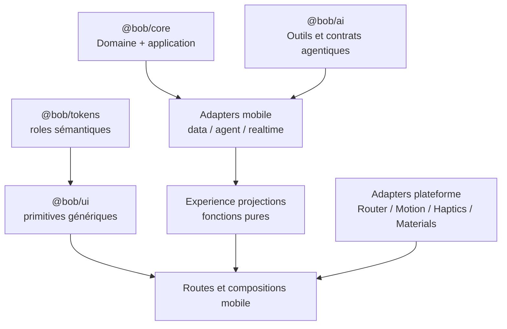

# Architecture technique de l'expérience mobile

> Statut : **Proposed**
> Dernière vérification du code : commit `2515ddf3`
> SDK de référence : **(corrigé A25 · 2026-07-30)** **Expo 57.0.8, React Native 0.86.0,
> React 19.2.3, Expo Router 57.0.8** — lu dans `apps/mobile/package.json` le 2026-07-30.
> ~~Expo 56, React Native 0.85, React 19.2, Expo Router 56~~ : exact au snapshot `2515ddf3`,
> périmé depuis. Le mobile a été porté sur le SDK 57 ; une gate qui exige une compatibilité
> « Expo 56 » certifierait une version que le produit n'exécute plus.
> IDs liés : G01–G22, V01–V14
>
> **Amendement A1 — 2026-07-29 · doctrine « matière Bob »**
> **Source.** Directive du fondateur du 2026-07-29 (« Je NE VEUX PAS une UI transparente à la
> iOS ») ; kit livré `packages/tokens/src/index.ts` (`surfaceTint`) et
> `packages/ui/src/components/bob-surface.tsx`.
> **Portée.** § « Surfaces et apparence » (algorithme de surface et règle de blur imbriqué) et
> ligne `Expo Blur/Glass` du tableau de dépendances. Le corps daté du 2026-07-23 n'est pas
> réécrit ; les passages supersédés restent cités.
> **Ce qui ne change pas.** Frontières d'architecture, projections pures, politique motion,
> observabilité, garde d'imports, migration et critères d'acceptation.
>
> **Amendement A25 — 2026-07-30 · SDK de référence** — en-tête. Source : `apps/mobile/package.json`
> (`expo ~57.0.8`, `react-native 0.86.0`, `react 19.2.3`, `expo-router ^57.0.8`).
>
> **Amendement A20 — 2026-07-30 · contrat `expo-blur`** — ligne `Expo Blur` du tableau de
> dépendances. Le port existait, son contrat de props n'était écrit nulle part.
>
> **Amendement A29 — 2026-07-30 · couture du port** — même ligne. Le contrat de props
> existait, la frontière de paquet restait indevinable : qui monte le `BlurTargetView`, à quel
> niveau de layout, et comment sa `ref` l'atteint sans que `packages/ui` importe `expo-blur`.
>
> **Amendement A18 — 2026-07-30 · préférences fail-CLOSED** — § Politique motion. `MotionMode` ne
> savait pas dire « je ne sais pas encore ».

## But

Ajouter une couche d'expérience cohérente sans introduire React Native, Expo, motion, couleur ou
navigation dans le domaine et sans donner à la présentation une autorité métier.

## État de dépendances observé

| Dépendance | État actuel | Décision requise |
| --- | --- | --- |
| Expo / RN / Router | Déclarés et utilisés. | Conserver Expo Router comme façade de navigation. |
| RN Animated | Utilisé dans plusieurs composants. | Migration progressive, pas réécriture big bang. |
| Reanimated | **(corrigé A7 · 2026-07-29)** **Déclaré directement** dans `apps/mobile` depuis `251271dc` (`react-native-reanimated` `4.5.0` + `react-native-worklets` `0.10.0`, prescrits par SDK 57), mais **importé par aucun fichier** de `apps/mobile` ni de `packages/ui/src`. Déclarer n'est pas adopter : le runtime reste à mettre en service. *Rédaction 2026-07-23, exacte au snapshot `2515ddf3`, supersédée par le fait : « présent transitivement dans le lock, pas dépendance directe mobile ».* | `UX-ADR-001`. |
| Gesture Handler | Déclaré et utilisé. **(précisé A7 · 2026-07-29 : `^2.32.0` ; `GestureHandlerRootView` à la racine et deux `Swipeable` de contenu — aucun usage dans le chrome ni dans `packages/ui/src`.)** | Réutiliser pour gestures autorisées. |
| Expo Haptics | Non déclaré directement. | Ajouter seulement après `UX-ADR-006` Accepted et certification acoustique. |
| Expo Blur | Non déclaré directement. | **(amendé A1 · 2026-07-29 ; contrat A20 · 2026-07-30)** Optionnel et borné : uniquement derrière le port `renderBlurLayer` de `ProgressiveBlurBob`, jamais importé par `packages/ui`. Le défaut produit reste sans flou. Si `D08` l'active, le contrat de props est **exécutable et unique** — `BlurTargetView` + `blurTarget` + `blurMethod="dimezisBlurViewSdk31Plus"`, Android **< 31 = rang N0 sans flou**, `experimentalBlurMethod` interdite : voir [04 § Contrat exécutable du port `renderBlurLayer`](04-navigation-scroll-surfaces.md#contrat-exécutable-du-port-renderblurlayer--expo-blur-expo-sdk-57). **(complété A29 · 2026-07-30)** La **couture** est écrite avec le contrat : type du port, propriétaire du `BlurTargetView` (`apps/mobile`, au shell d'écran), `ref` capturée par closure — donc jamais typée dans `@bob/ui` —, englobement garanti par construction, et interdiction au-dessus d'une liste virtualisée : [04 § Couture du port](04-navigation-scroll-surfaces.md#couture-du-port--qui-rend-quoi-de-part-et-dautre-de-la-frontière-de-paquet). |
| Expo Glass (`expo-glass-effect`) | Non déclaré directement. | **(amendé A1 · 2026-07-29)** **Ne sera pas adopté.** Hors doctrine « matière Bob » : le verre système impose la teinte de l'OS, pas la nôtre. Contrôle statique d'import à ajouter. |
| Skia | Non déclaré mobile directement. | Spike uniquement si Bob/chart le justifie. |
| FlashList | Déclaré. | Conserver pour longues listes et profiler transitions. |
| SVG/LinearGradient | Déclarés. | Socle préféré pour signature légère. |

Une dépendance transitive n'est jamais importée directement. Toute adoption passe par `expo install`,
compatibilité, pin, build dev client et preuve release.

## Frontières



### `packages/core`

- Aucun import React, RN, Expo, Reanimated, couleur, easing ou route.
- Continue de posséder calculs, règles, valeurs, commandes et résultats.
- N'est pas modifié pour satisfaire une animation.

### `packages/ai`

- Possède les contrats provider-neutral et interactions agentiques lorsqu'ils sont acceptés.
- Ne connaît pas l'orb, le gradient, le blur ou le timing.
- Les événements nécessaires à la vérité visuelle sont sémantiques, pas graphiques.

### `packages/tokens`

- Rôles de couleur/surface/typographie/motion purs et sérialisables.
- Aucune dépendance RN.
- Les tokens motion décrivent une intention, pas un écran.

### `packages/ui`

- Primitives génériques : Button, Pressable, Sheet, Segment, Toast, Skeleton, Surface.
- Connaît la politique de motion/accessibilité, pas les routes ni providers.
- Ne connaît aucun état `Mistral`, `OpenAI` ou outil métier.

### `apps/mobile/src/experience`

- Adapters de préférences système, haptique, capability et observabilité.
- Projections pures état applicatif/transport → view model.
- Compositions spécifiques Bob.
- Aucun use case dupliqué.

### Routes

- Orchestrent query/data, view model, navigation et composition.
- Ne déclarent pas de durées/easings arbitraires.
- Ne convertissent pas une animation en autorité d'action.

## Arborescence cible indicative

```text
packages/tokens/src/
  motion.ts
  surfaces.ts

packages/ui/src/
  motion/
    motion-provider.tsx
    motion-primitives.tsx
    layout-transition.tsx
  surfaces/
    adaptive-surface.tsx
  feedback/
    semantic-haptic.ts

apps/mobile/src/experience/
  accessibility/
    preferences-adapter.ts
    focus-policy.ts
  haptics/
    expo-haptics-adapter.ts
    haptic-policy.ts
  motion/
    motion-policy.ts
    screen-visibility.ts
  navigation/
    route-presentation.ts
    status-bar-owner.ts
  surfaces/
    platform-capabilities.ts
  bob-live/
    visual-state.ts
    visual-projection.ts
    audio-meter-port.ts
    audio-meter-smoothing.ts
  observability/
    experience-metrics.ts
```

Cette structure est une cible de discussion, pas un ordre de création de fichiers.

## Projection d'état

La présentation consomme une fonction pure :

```ts
type ExperienceEvent =
  | { type: 'command.pending'; commandId: string }
  | { type: 'command.succeeded'; commandId: string; revision: number }
  | { type: 'command.failed'; commandId: string; recoverable: boolean }
  | { type: 'voice.phase'; phase: CanonicalVoicePhase; generation: number }
  | { type: 'voice.amplitude'; direction: 'input' | 'output'; value: number; generation: number };

function projectExperience(
  previous: ExperienceViewModel,
  event: ExperienceEvent,
): ExperienceViewModel;
```

Contraintes :

- idempotence des événements ;
- génération/révision pour rejeter le tardif ;
- aucun timer comme source de statut ;
- timeout transformé en inconnu/récupérable ;
- state final conservé si l'animation est désactivée ;
- fonction testable sans renderer.

## Politique motion

```ts
type MotionMode = 'full' | 'crossfade_only' | 'off';

/**
 * (amendé A18 · 2026-07-30) Une préférence système a TROIS états : on ne la connaît pas
 * au premier rendu, elle se lit de façon asynchrone. `unknown` n'est pas un détail
 * d'implémentation : c'est l'état par défaut, et il se replie du côté SÛR.
 */
type PreferenceState = 'unknown' | 'on' | 'off';

interface ExperiencePreferences {
  /** `unknown` → politique 'off' (durée 0), jamais 'full'. */
  motionMode: MotionMode | 'unknown';
  reduceTransparency: PreferenceState;
  increaseContrast: PreferenceState;
  screenReader: PreferenceState;
  colorScheme: 'light' | 'dark';
}

interface MotionPolicy {
  feedback(intent: FeedbackIntent): MotionSpec;
  transition(intent: TransitionIntent): MotionSpec;
  layout(intent: LayoutIntent): MotionSpec;
}
```

Le provider observe les préférences système et fournit une politique. Les composants ne lisent pas
directement plusieurs APIs avec des règles divergentes.

**(ajouté A18 · 2026-07-30)** Il les résout **une seule fois**, au démarrage, avant le premier frame
d'interface utile, et les mémorise : tout composant monté ensuite reçoit une valeur **synchrone**.
Tant qu'une valeur est `unknown`, la politique renvoie la variante **réduite** — durée 0, aucun flou,
aucun détecteur de geste qui consomme les touches d'exploration. Règle complète et preuve exigée :
[08 § Préférences d'accessibilité et premier rendu](08-accessibility-adaptive-design.md#préférences-daccessibilité-et-premier-rendu).
C'est aussi la raison pour laquelle un composant animé n'appelle pas `AccessibilityInfo` lui-même :
chaque lecture locale rouvre une fenêtre d'ignorance, et il y en a autant que de composants.

## Runtime motion

Décision proposée par `UX-ADR-001` :

- native Stack pour les routes ;
- Reanimated pour interactions/layout/scroll interrompables ;
- RN Animated existant maintenu jusqu'à migration naturelle ;
- aucun mélange de moteurs sur la même propriété du même élément ;
- Skia uniquement pour signature Bob/chart après spike ;
- transform/opacity en priorité ;
- animations stoppées hors focus/background.

## Navigation

Décision proposée par `UX-ADR-002` :

- Expo Router uniquement dans l'app ;
- matrice de présentation typée ;
- Native Stack conserve l'autorité de navigation ;
- tab bar actuelle comme fallback stable ;
- Native Tabs et Apple Zoom comme expériences figées au démarrage, jamais dépendances obligatoires ;
- formSheet natif lorsque la tâche et la plateforme le permettent ;
- sheet applicative partagée pour les cas cross-platform nécessitant contrôle.

## Surfaces et apparence

Décision proposée par `UX-ADR-004`, **amendée A1 le 2026-07-29** (doctrine « matière Bob ») :

```text
0. accessibilité d'abord
   reduceMotion       → aucune matière animée (durée 0, état final immédiat)
   reduceTransparency → aucun effet (le rang 1 est déjà opaque)
   increaseContrast   → bordure renforcée, même surface

1. surface TEINTÉE Bob (surfaceTint / BobSurface), opaque      ← matière NOMINALE, chrome compris
2. flou LÉGER de bord, retombée non interactive au-dessus d'une teinte opaque   ← option bornée
3. repli OPAQUE unique (la teinte seule, zéro échantillon de flou)              ← défaut sûr
   Le verre système (Liquid Glass / expo-glass-effect) n'est PAS un rang : hors doctrine.
```

> Rédaction initiale 2026-07-23 (supersédée par A1) : `reduceTransparency → opaque ; sinon glass
> disponible + chrome éligible → glass ; sinon blur disponible + budget tenu → blur ; sinon →
> opaque`. Elle plaçait le verre système au premier rang et ne faisait pas de la surface teintée
> un rang du tout. Motif de l'amendement : directive du fondateur du 2026-07-29 — « Je NE VEUX PAS
> une UI transparente à la iOS » ; le verre système impose la teinte du système, pas la nôtre.

- **la matière est la même sur tous les OS et toutes les versions** : aucune surface n'est
  sélectionnée par capability runtime, donc aucune QA combinatoire matière × OS ;
- **jamais de blur IMBRIQUÉ** — au sens strict : une surface floutée dont le sous-arbre contient
  une autre surface floutée. Un EMPILEMENT de couches **frères** en zone non interactive n'est pas
  une imbrication et reste autorisé, borné par le budget de
  [10 — Performance](10-performance-observability.md) ;
- jamais de blur comme fond d'une surface porteuse d'information (carte, ligne, formulaire,
  montant) : ces surfaces sont teintées opaques ;
- contraste calculé indépendamment du fond ;
- le choix de surface ne change pas la géométrie ni l'action ;
- StatusBar appartient à la route de premier plan ;
- le contrat clair/sombre est explicite (`surfaceTint.light` / `surfaceTint.dark`, résolution
  `light` par défaut tant qu'UX-ADR-004 n'active pas le sombre).

### Autorité de matière

`packages/tokens/src/index.ts` (`surfaceTint`) et `packages/ui/src/components/bob-surface.tsx` sont
la **norme exécutable** de ce paragraphe : livrés, testés (contrastes AA dans `index.test.ts`) et
déjà consommés par les écrans Équipements. Aucune spécification de ce dossier ne peut redéfinir un
token existant ni proposer une matière concurrente ; elle peut seulement s'y ajouter. **En cas de
divergence entre un document et le code du kit, le code fait foi.**

Chemins exacts et périmètre du kit :
[17 § Autorités normatives](17-references.md#autorités-normatives).

## Bob Live

Décision proposée par `UX-ADR-003` :

- projection provider-neutral ;
- état visuel dérivé, jamais autoritaire ;
- amplitude éphémère avec génération et direction ;
- aucun audio/transcript/amplitude dans la télémétrie ;
- si l'amplitude output manque, animation déterministe annoncée comme dégradation interne ;
- renderer choisi au démarrage d'une session et stable pendant la session ;
- kill switch visuel indépendant du flag transport.

## Audio meter port

```ts
interface AudioMeterSample {
  direction: 'input' | 'output';
  normalizedLevel: number;
  generation: number;
  turnId?: string;
  monotonicTimestampMs: number;
}

interface AudioMeterPort {
  subscribe(listener: (sample: AudioMeterSample) => void): () => void;
}
```

- 20–30 Hz suffisent pour la projection ;
- rejet des générations anciennes ;
- smoothing UI thread ;
- aucune persistance ;
- subscription coupée à l'arrière-plan et au démontage.

## Haptique

Décision proposée par `UX-ADR-006` : adapter unique avec policy sémantique. Les composants demandent
`selection`, `success`, `warning`, `error` ou `impact`, jamais une API plateforme brute. Le policy
peut ne rien produire selon préférence, état micro, appareil ou contexte ; aucun retour pendant la
capture Bob n'est autorisé avant preuve acoustique explicite.

## Observabilité

Métriques autorisées : phase normalisée, durée, catégorie de transition, slow frame, flag/version,
OS/device class pseudonymisée et résultat. Interdits : texte utilisateur, client, montant, route
avec ID, transcript, audio, amplitude fine et arguments d'outil.

Le signal de succès vient du use case/transport ; la télémétrie motion ne peut pas déclarer une
action métier réussie.

## Flags et stabilité de session

```ts
interface ExperienceFeatureSet {
  motionV2: boolean;
  adaptiveChromeV1: boolean;
  nativeSheetsV1: boolean;
  bobVisualV2: boolean;
  navigationExperiment: 'legacy' | 'native_tabs_spike';
}
```

- Résolu au démarrage pour navigator et renderer Bob actif.
- Une session Bob ne change pas de renderer en cours.
- Les composants simples peuvent recevoir une mise à jour de flag hors interaction active.
- Un flag ne modifie jamais entitlement, confirmation ou provider.

## Migration

1. Ajouter tests de frontière et tokens sans changer le rendu.
2. Ajouter providers/adapters derrière flags OFF.
3. Migrer Button/Pressable/Segment/Toast.
4. Remplacer Sheet après validation clavier/accessibilité.
5. Migrer navigation/chrome par route.
6. Ajouter projection Bob sans changer le transport.
7. Migrer écrans par epic.
8. Retirer legacy seulement après deux releases stables.

Chaque étape laisse un état publiable.

## Garde d'imports proposée

- `packages/core/**` interdit `react`, `react-native`, `expo-*`, `reanimated`.
- `packages/ui/**` interdit `expo-router` et les modules realtime.
- `packages/tokens/**` interdit React/RN et adapters.
- `apps/mobile/src/realtime/**` interdit composants UI/tokens visuels.
- `apps/mobile/src/experience/**` peut importer UI/tokens/adapters, pas écrire dans la BDD ni
  appeler directement un effet métier.

## Critères d'acceptation architecture

- [ ] ADR UX acceptés avant ajout de dépendance.
- [ ] Garde d'imports automatisée.
- [ ] Projections pures testées avec événements tardifs/désordonnés.
- [ ] Aucun état graphique dans core/AI/realtime.
- [ ] Aucun use case dupliqué dans la couche experience.
- [ ] Dépendances directes installées par Expo et certifiées dev client/release.
- [ ] Fallback stable pour chaque API versionnée.
- [ ] Flags indépendants du provider et des entitlements.
- [ ] Aucun PII/audio/transcript dans l'observabilité.
- [ ] Migration progressive et rollback exercé.
