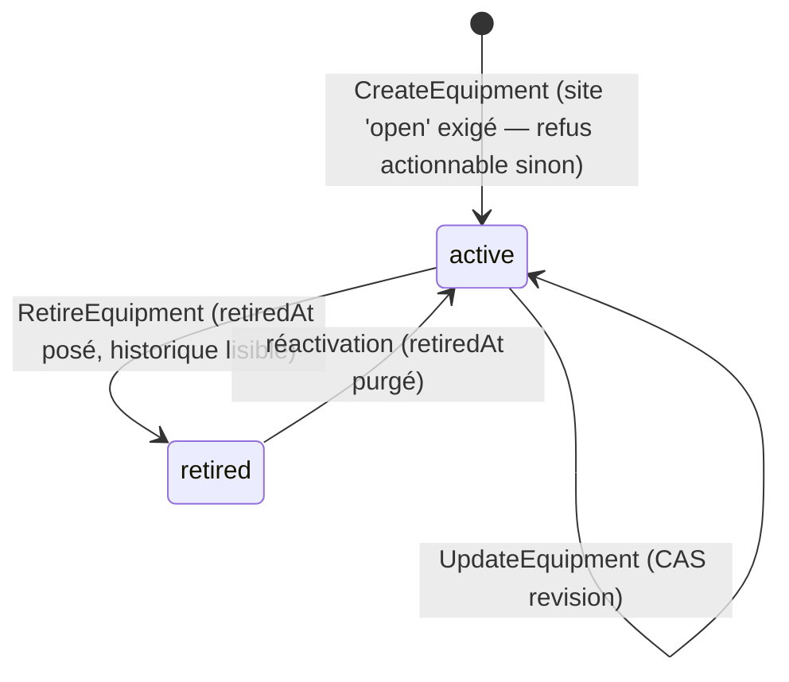
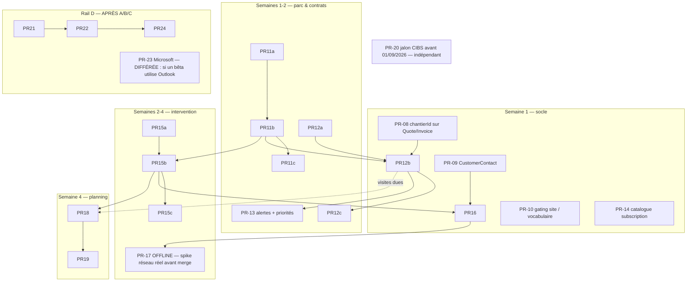

# Conception domaine — Vague P1 « Le métier de la maintenance » (bêta Fly Services) — RÉVISION 2

> **Statut** : document de CONCEPTION (aucun code). Base auditée : `main` @ dceaf6e4, 27/07/2026. Révision intégrant la revue adversariale (16 problèmes + 16 améliorations, TOUS traités) ; chaque point contesté a été revérifié CONTRE LE CODE RÉEL (`compose-standalone-invoice.ts`, `issue-invoice.ts`, `state-machines.ts` INVOICE_TRANSITIONS, trigger `invoices_legal_traceability` @ migration 20260719010000, `NotificationJob` @ schema.prisma:1325).
> Compagnon d'exécution de `docs/superpowers/plans/beta-fly-services-roadmap.md` (vague P1 + amendements fondateur du 26/07) et de `docs/strategy/beta-fly-services-gap-analysis.md`.
> Gouvernance : cap V1 / feature freeze — accord Claude+GPT puis GO fondateur par PR ; PR → staging validé → prod ; aucun build EAS sans GO.

---

## 0. Cadre et patrons de repo réutilisés

Tout ce document ÉTEND des briques prouvées en production — il ne crée jamais quand il peut étendre :

| Patron | Source réelle (code) | Usage P1 |
|---|---|---|
| Machine à états table + `assertTransition` | `packages/core/src/domain/billing/shared/state-machines.ts` | Contrat, Intervention, connexion mail |
| Preuve de signature `{method:'onsite_draw', sha256, capturedAt}` — hash calculé SERVEUR | `domain/billing/shared/signature.ts` + `application/billing/sign-quote.ts` | `SignIntervention` |
| Proposition à confirmer, jamais d'effet caché | `generate-invoice-from-quote.ts`, `compose-standalone-invoice.ts` | Facture annuelle, visites planifiées, CTA facturer |
| Priorité DÉRIVÉE de l'état réel, jamais un statut inventé | `application/today/derive-today-priorities.ts` (fail-closed `undefined`/`null`) | `contrat_facture_annuelle`, `contrat_renouvellement`, `visite_du_jour`, `intervention_a_facturer` |
| Outbox `NotificationJob` (`@@unique(companyId, kind, dedupeKey)`, `nextAttemptAt` = embargo) | `schema.prisma:1325` + patron `embargo-scheduled-payment` | Alertes J-60/J-30, rappel J-1, envoi fiche |
| FK composites `(companyId, …)` anti-IDOR + `ENABLE`+`FORCE RLS` + policy `tenant_isolation` + grants release.sh | migration `20260717150000_chantier_notes_photos`, `scripts/release.sh:429-460` | TOUTES les nouvelles tables (Bloc D inclus — corrigé) |
| Migrations additives, `SET LOCAL lock_timeout/statement_timeout`, `NOT VALID`→`VALIDATE` séparés, CHECK générés depuis la source TS, writer N-1, audit consommateurs | AGENTS.md « Release Lessons 25/07 » | Toutes les migrations P1 |
| Idempotence client `keyHash` tenant-salé + `payloadHash`, registre INSERT-only | `packages/api-client/src/quote-idempotency.ts` | Outbox offline de la fiche |
| Jeton public révocable, hashé, `lastUsedAt` | `PublicAccessToken` + `create-document-view-link.ts` | Export ICS `calendar_feed` |
| AEAD AES-256-GCM + keyring versionné | `cabinet-token.ts`, keyrings `env.ts` | Jetons OAuth boîte mail |
| Parité outil-IA ↔ use case (mêmes endpoints) | `packages/ai/src/tools/registry.ts` | Un outil par nouveau use case + conception vocale propre (§8) |
| Copies 3 tons | `build-relance.ts`, `CompanyBillingSettings.relance*` | Toute copy sortante |
| Coffre `StoredDocument` + `WorksiteMediaStorage`/`DocumentStoragePort` | `schema.prisma:105-136, 1115` | PDF fiche, photos taguées |

Conventions transverses : ids par `IdGeneratorPort` (côté client pour l'intervention offline), `ClockPort`, `DateOnly`/`Instant`, `revision Int` CAS + `lockById` sous `UnitOfWorkPort`, statuts `String` + CHECK SQL généré depuis l'union TS, zéro framework dans `packages/core`, LegalHint au point de décision, reduce-motion, Vitest par invariant + rituel `tsc -p tsconfig.json` complet.

**Doctrine renforcée par la revue (transversale)** : tout fait de couverture/complétude est DÉRIVÉ des pièces réelles non annulées — jamais tenu par un compteur mutable qui pourrait mentir après une annulation. Aucun cron ne mute un état métier : un cron matérialise des `NotificationJob`, rien d'autre.

---

## 1. Bloc A — Parc d'équipements (`Equipment`, exigence 2, C1)

### 1.1 Décisions actées
- `Chantier` **est** le site générique. `Equipment` s'y rattache, jamais à `Customer`.
- Table MINIMALE, `kind` libellé libre (aucune taxonomie codée). Certificats/garanties = `StoredDocument` lié.
- Historique/photos PAR équipement sans nouvelle table : `equipmentId` NULLABLE additif sur `ChantierNote`/`ChantierPhoto` (lignes historiques non taguées, aucun backfill).
- Cycle `active | retired` ; retrait logique, jamais DELETE. **[Revue P11]** `retiredAt DateTime? @db.Timestamptz(6)` additif : posé par la transition `retired`, PURGÉ (`null`) à la réactivation — l'écran « Retirée le 02/05/2026 » affiche un fait réel, jamais `updatedAt` (donnée qui serait fabriquée).
- **[Revue A12 — site clos]** Création d'équipement (et d'intervention/contrat, §2-3) sur un `Chantier` `closed` → refus actionnable « Ce site est clôturé — rouvre-le pour ajouter » + proposition de réouverture. `close()` existe au code (`chantier.ts:63`) ; la symétrie `reopen()` (closed→open) est un ajout minimal de PR-11a si absente — décision writer, mais le comportement fail-closed est l'engagement.

### 1.2 Modèle Prisma + esquisse SQL

```prisma
model Equipment {
  id            String    @id
  companyId     String
  company       Company   @relation(fields: [companyId], references: [id], onDelete: Restrict)
  chantierId    String
  chantier      Chantier  @relation(fields: [chantierId, companyId], references: [id, companyId], onDelete: Restrict, onUpdate: Cascade)
  label         String
  kind          String?   // libellé LIBRE — jamais d'enum métier, PAS de CHECK d'énumération (btrim/longueur seulement)
  brand         String?
  serialNumber  String?
  location      String?
  installedAt   DateTime? @db.Date
  warrantyUntil DateTime? @db.Date
  status        String    @default("active") // 'active' | 'retired' — CHECK généré depuis la source TS
  retiredAt     DateTime? @db.Timestamptz(6) // [P11] fait de retrait ; null si active (CHECK triple cohérence)
  notes         String?
  revision      Int       @default(1)
  createdAt     DateTime  @default(now()) @db.Timestamptz(6)
  updatedAt     DateTime  @updatedAt @db.Timestamptz(6)

  @@unique([id, companyId], name: "uniq_equipment_id_company", map: "uniq_equipment_id_company")
  @@index([companyId, chantierId, status], map: "equipments_company_chantier_status_idx")
  @@map("equipments")
}
// + ChantierNote.equipmentId String? / ChantierPhoto.equipmentId String? (FK composites (equipmentId, companyId))
```

```sql
-- Migration 1 (table neuve, contraintes inline) : SET LOCAL lock_timeout='5s'; statement_timeout='60s';
-- PK, UNIQUE(id,companyId), FK companies, FK composite (chantierId,companyId)→chantiers ON DELETE RESTRICT,
-- CHECK status IN ('active','retired') (généré depuis TS), label btrim 1..200 sans cntrl,
-- warrantyUntil>=installedAt si les deux, notes<=2000,
-- [P11] CHECK ( (status='retired') = ("retiredAt" IS NOT NULL) )  -- jamais un demi-état
-- + index (companyId,chantierId,status). RLS ENABLE+FORCE + policy tenant_isolation.
-- release.sh : GRANT S/I/U (PAS de DELETE) + REVOKE anon/authenticated/service_role.

-- Migration 2 (tables EXISTANTES, additif) : ADD COLUMN equipmentId TEXT sur chantier_notes/chantier_photos,
-- FK composites NOT VALID, index partiels (companyId,equipmentId,createdAt DESC) WHERE equipmentId IS NOT NULL.
-- [Amélioration 8] CREATE INDEX non-CONCURRENTLY assumé et DOCUMENTÉ dans la migration : volumétrie bêta
-- faible + lock_timeout 5s posé ; règle de bascule écrite : si au moment de la PR la table dépasse ~100k
-- lignes en prod, l'index part en CONCURRENTLY hors transaction (migration dédiée, patron à commenter).

-- Migration 3 (séparée, leçon 25/07) : VALIDATE CONSTRAINT sur les deux FK.
```

Cohérence équipement↔chantier : garde use case fail-closed (`equipment.chantierId === note.chantierId`) + trigger `equipment_scope_coherence` sur INSERT/UPDATE de `chantier_notes`/`chantier_photos` (même famille que `invoices_legal_traceability`). Writer N-1 exigé (forme de ligne sans `equipmentId` sous chaque état du trigger).

### 1.3 Agrégat core & VOs (`packages/core/src/domain/equipment/equipment.ts`)
- VOs : `EquipmentId`, `EquipmentStatus = 'active' | 'retired'` (source du CHECK), `DateOnly` réutilisé.
- Invariants au `record()` : label 1..200 trimmé sans cntrl ; `warrantyUntil ≥ installedAt` ; notes ≤ 2000 ; `kind/brand/serialNumber/location` trimmés ≤ 200 (kind SANS liste fermée) ; transitions `EQUIPMENT_TRANSITIONS = { active: ['retired'], retired: ['active'] }` + `assertTransition` ; `retire(at)` pose `retiredAt`, `reactivate()` le purge (cohérence triple garantie domaine + CHECK SQL).

### 1.4 Cycle d'état



### 1.5 Use cases + ports (`application/equipment/`)
- Port `EquipmentRepository` : `findById`, `lockById`, `listByChantier`, `listByCompany`, `save`.
- `CreateEquipment` (chantier existant + même tenant + `open` — fail-closed), `UpdateEquipment` (CAS), `RetireEquipment`.
- **[Amélioration 4]** `RetireEquipment` sous contrat actif : le use case retourne un avertissement honnête NON bloquant quand l'équipement figure dans `MaintenanceContractEquipment` d'un contrat `active` — « Couvert par le contrat {label} : la couverture (et son prix) continue jusqu'à modification du contrat » ; le retrait reste possible (la réalité du terrain prime), la fiche contrat AFFICHE « 3 équipements couverts dont 1 retiré » (dérivation, §2).
- `GetEquipmentHistory` (dérivation PURE, zéro I/O) : fusion triée desc de `ChantierNote[equipmentId]` + `ChantierPhoto[equipmentId]` + `Intervention[equipmentId]` + `StoredDocument[linkedEntityType='equipment']`.
- API : `GET/POST /chantiers/:chantierId/equipments`, `PUT /equipments/:id`, `POST /equipments/:id/retire`, `GET /equipments/:id/history`.

### 1.6 Parité outil-IA (mêmes use cases, mêmes endpoints)

| Outil | Use case | Exemple vocal |
|---|---|---|
| `ajouter_equipement` | CreateEquipment | « Ajoute une fontaine à l'accueil du site Bastille » |
| `parc_du_site` | listByChantier | « Montre-moi le parc du site RATP Bastille » |
| `historique_equipement` | GetEquipmentHistory | « L'historique de la fontaine de l'accueil » |
| `retirer_equipement` | RetireEquipment | « La vitrine froide est déposée, retire-la du parc » (l'avertissement contrat est DIT à la voix avant confirmation) |

**Conception vocale propre (norme fondateur 27/07)** : consigne composite désordonnée acceptée — « la fontaine du deuxième chez RATP, marque Culligan, elle est sous garantie jusqu'en mars 2027, ajoute-la » → Bob extrait TOUS les faits (site, label, kind implicite « fontaine », marque, garantie) en une passe, complète par questions ciblées uniquement pour les faits manquants REQUIS (label/site), puis UNE confirmation groupée avant la seule mutation (`CreateEquipment`). Les lectures (`parc_du_site`, `historique_equipement`) ne demandent JAMAIS de confirmation.

### 1.7 Plan de tests
- Domaine : label vide refusé ; garantie < pose refusée ; matrice transitions ; **cohérence `retiredAt` (retire pose, réactivation purge, jamais un demi-état)** ; limites longueurs ; `kind` accepte tout libellé trimmé.
- Use cases : anti-IDOR chantier autre tenant ; **site `closed` → refus actionnable** ; CAS revision ; avertissement retrait sous contrat actif (présent/absent selon liaison) ; historique fusionné/trié fail-closed.
- Migration : writer N-1 notes/photos ; cert RLS/grants staging ; trigger cohérence ; CHECK triple retiredAt.

### 1.8 Découpage PR (raffine PR-11)
1. **PR-11a** domaine+application purs (dont `reopen()` chantier si absent). 2. **PR-11b** persistance+API+writer N-1+cert. 3. **PR-11c** mobile+voix.

---

## 2. Bloc B — Contrat de maintenance (`MaintenanceContract`, exigence 3, C2)

### 2.1 Décisions actées (révisées par la revue)
- Cœur du revenu Fly Services (≈ 400 €/équipement/an, 2 passages/an, tacite reconduction, préavis 1 mois) ; modèle minimal généralisable ; indexation = texte en `notes` (post-V1).
- **[Direction 5 — vérifié au code]** **Contrats V1 = B2B/B2G UNIQUEMENT.** `ComposeStandaloneInvoice` refuse fail-closed toute facture directe à un consommateur sans urgence qualifiée (`STANDALONE_B2C_REQUIRES_URGENT_REPAIR_MESSAGE`, compose-standalone-invoice.ts:117-125) et `IssueInvoice` REVALIDE ce refus à l'émission (issue-invoice.ts:246-258) : la facture annuelle d'un contrat B2C serait structurellement refusée. Décision : `CreateMaintenanceContract` ET `ActivateContract` refusent un client `b2c` (refus actionnable, message unique) + LegalHint : « Les contrats particuliers exigent le devoir d'information avant reconduction tacite (art. L215-1 code conso, loi Chatel) et un cadre de facturation dédié — Bob les ajoutera proprement plutôt que mal. En attendant : devis signé annuel. » **Chemin B2C = P2 documenté** (§7) : base contractuelle levant la garde standalone (le contrat signé remplace le devis) + rappel Chatel L215-1 matérialisé en NotificationJob + mention sur la pièce. Rien de cela n'est improvisé en V1.
- **[Direction 2]** **Période courante ARITHMÉTIQUE, AUCUNE mutation d'état par cron.** `anniversaryDate` est la date de DÉBUT INITIALE du contrat (immuable après activation). La période courante est un CALCUL PUR : `N = nombre d'années entières écoulées depuis anniversaryDate`, période = `[anniversaryDate + N ans, anniversaryDate + (N+1) ans)`. La reconduction tacite n'est NI un état NI un événement stocké : c'est un FAIT DÉRIVÉ (« reconduit tacitement le {anniversaryDate + k ans} » pour chaque k ≤ N, si `tacitRenewal`), affiché honnêtement comme calculé. Le use case `RecordContractRenewal` du brouillon précédent est SUPPRIMÉ (il créait une mutation cron non conçue, une concurrence avec la résiliation, et tuait la fenêtre −30 j des années > 1 — problème P3). Le cron 6 h ne fait QUE des `NotificationJob` d'alerte. **La résiliation avec préavis est le SEUL événement d'état après l'activation.**
- **[Direction 1 — vérifié au code]** **Couverture de facturation DÉRIVÉE des factures réelles.** `INVOICE_TRANSITIONS` permet `issued → cancelled` (state-machines.ts:26) : un compteur monotone `billedThrough` mentirait après annulation (période « à jour » à tort, revenu perdu — problème P2). Décision : la colonne `billedThrough` est SUPPRIMÉE du modèle. La couverture est une dérivation pure sur les factures NON annulées portant `(maintenanceContractId, servicePeriodStart/End)` — index partiel dédié. Extinction ET réallumage par l'état réel (facture annulée → la période redevient due, comme `intervention_a_facturer`). Si un cache devient nécessaire (perf, jamais en bêta), il sera reconstructible et JAMAIS autorité — non-but V1.
- La résiliation subie n'est JAMAIS interdite ; préavis AFFICHÉ (LegalHint), non bloquant.
- Montant annuel = Σ lignes, jamais stocké.
- Jamais d'envoi ni d'émission auto : facture annuelle = BROUILLON proposé en un tap ; visites planifiées = PROPOSITION confirmée.
- **[Revue P13 — onboarding]** Contrats MIGRÉS (Fly Services jour 1) : `anniversaryDate` peut être dans le passé (vraie date de début) + champ déclaratif `importCoveredUntil DateTime? @db.Date` — « déjà facturé hors Bob jusqu'au … » (fait déclaré à la création, éditable en `draft` uniquement, figé à l'activation). La dérivation de facturation traite une période comme couverte si `period.end ≤ importCoveredUntil` OU si une facture non annulée la couvre. Les visites dues ne sont dérivées que pour les créneaux dont la fenêtre commence après `activatedAt` (activation DANS Bob) — zéro alerte inventée jour 1, aucune visite « en retard » fantôme.

### 2.2 Modèle Prisma + esquisse SQL

```prisma
model MaintenanceContract {
  id                       String    @id
  companyId                String
  company                  Company   @relation(fields: [companyId], references: [id], onDelete: Restrict)
  customerId               String    // b2b/b2g uniquement en V1 — garde use case (création + activation)
  customer                 Customer  @relation(fields: [customerId, companyId], references: [id, companyId], onDelete: Restrict, onUpdate: Cascade)
  chantierId               String?
  chantier                 Chantier? @relation(fields: [chantierId, companyId], references: [id, companyId], onDelete: Restrict, onUpdate: Cascade)
  label                    String
  status                   String    @default("draft") // 'draft' | 'active' | 'terminated'
  anniversaryDate          DateTime  @db.Date  // début INITIAL du contrat — IMMUABLE après activation ;
                                               // la période courante est CALCULÉE (jamais mutée) : +N ans
  noticeDays               Int       @default(30)
  visitsPerYear            Int       @default(2)
  tacitRenewal             Boolean   @default(true)
  importCoveredUntil       DateTime? @db.Date  // [P13] déclaré : facturé hors Bob jusqu'à (exclusif) — figé à l'activation
  activatedAt              DateTime? @db.Timestamptz(6)
  terminatedAt             DateTime? @db.Timestamptz(6) // date de la DÉCISION
  terminationEffectiveDate DateTime? @db.Date           // fin de couverture (défaut : prochain anniversaire calculé)
  terminationNote          String?
  notes                    String?
  revision                 Int       @default(1)
  createdAt                DateTime  @default(now()) @db.Timestamptz(6)
  updatedAt                DateTime  @updatedAt @db.Timestamptz(6)
  lines                    MaintenanceContractLine[]
  equipments               MaintenanceContractEquipment[]

  @@unique([id, companyId], name: "uniq_maintenance_contract_id_company")
  @@index([companyId, status, anniversaryDate])
  @@index([customerId, companyId])
  @@map("maintenance_contracts")
}
// MaintenanceContractLine : inchangé du brouillon (miroir LineItem — centimes Int, TVA Decimal(4,2),
//   quantité Decimal(12,3), catalogueItemId?, @@unique([id, companyId]), FK composite contrat).
// MaintenanceContractEquipment : inchangé (@@id([companyId, contractId, equipmentId]), FK composites).
```

```sql
-- CHECKs (générés depuis la source TS) : status IN ('draft','active','terminated') ;
-- noticeDays 0..365 ; visitsPerYear 0..52 ; label btrim 1..200 ; notes/terminationNote <= 2000 ;
-- CHECK ( (status='terminated') = ("terminatedAt" IS NOT NULL AND "terminationEffectiveDate" IS NOT NULL) );
-- CHECK ( "terminationNote" IS NULL OR status='terminated' );
-- CHECK ( status='draft' OR "activatedAt" IS NOT NULL )  -- un actif/résilié a toujours son fait d'activation
-- Lignes : unitPriceHtCents >= 0 ; quantity > 0 ; position >= 0.
-- RLS ENABLE+FORCE + tenant_isolation sur les 3 tables.
-- Grants : contracts S/I/U/D (DELETE = brouillon seulement) ; [Amélioration 1 — défense en profondeur]
--   trigger BEFORE DELETE maintenance_contracts_draft_only_delete : RAISE si OLD.status <> 'draft'
--   (même famille que les gardes SQL existantes — le grant ne suffit jamais seul) ;
--   lines S/I/U/D ; contract_equipments S/I/D. + REVOKE anon/authenticated/service_role.

-- [Direction 4] Colonnes ADDITIVES sur invoices (le brouillon de contrat PORTE sa période) :
--   ALTER TABLE "invoices" ADD COLUMN "maintenanceContractId" TEXT;
--   ALTER TABLE "invoices" ADD COLUMN "chantierId" TEXT; -- si PR-08 ne l'a pas déjà posée (dépendance)
--   FK composites NOT VALID → VALIDATE en migration séparée.
--   Index PARTIEL de dérivation de couverture :
--   CREATE INDEX invoices_contract_period_idx ON "invoices"("companyId","maintenanceContractId","servicePeriodStart")
--     WHERE "maintenanceContractId" IS NOT NULL;
--   AUDIT CONSOMMATEURS même commit (leçon 25/07) : redéfinition COMPLÈTE de
--   enforce_invoice_legal_traceability() (corps du précédent 20260719010000 + ajout à la liste des
--   champs figés post-émission : maintenanceContractId, servicePeriodStart, servicePeriodEnd, chantierId) ;
--   writer N-1 rejoué (forme de ligne sans les colonnes) sous CHAQUE état du trigger ; renderer PDF,
--   Factur-X, api-client, export : audit de non-impact (colonnes additives nullables).
```

### 2.3 Agrégat core & VOs (`domain/contract/maintenance-contract.ts`)
- VOs : `MaintenanceContractStatus`, `ContractPeriod {start; end}` (end exclusive), `ContractLine` (règles monétaires LineItem).
- Invariants : label non vide ; `noticeDays ≥ 0` ; `visitsPerYear ≥ 0` ; montant annuel = `contractAnnualTotals(lines)` via `computeLineBases`, JAMAIS persisté ; `activate(customer)` exige ≥ 1 ligne + `anniversaryDate` + client `b2b|b2g` (refus actionnable + LegalHint Chatel sinon) et FIGE `anniversaryDate` + `importCoveredUntil` ; `terminate(decidedAt, effectiveDate, note)` : uniquement depuis `active`, TOUJOURS possible, `effectiveDate` défaut = prochain anniversaire CALCULÉ, préavis affiché non bloquant ; lignes/équipements modifiables en `draft` et `active` (CAS), figés en `terminated` ; transitions `CONTRACT_TRANSITIONS = { draft: ['active'], active: ['terminated'], terminated: [] }`.
- **Aucune méthode `renew()`** : la reconduction n'existe pas comme mutation.

### 2.4 Machine à états (ajustée — direction 2)

```mermaid
stateDiagram-v2
    [*] --> draft : CreateMaintenanceContract (b2c refusé + LegalHint Chatel)
    draft --> active : ActivateContract (≥1 ligne, anniversaryDate posée,\nclient b2b/b2g revérifié — anniversaryDate/importCoveredUntil FIGÉS)
    draft --> [*] : DeleteDraftContract (+ trigger BEFORE DELETE draft-only)
    active --> terminated : TerminateContract — SEUL événement d'état\naprès activation ; trace décision+motif+date d'effet ;\npréavis AFFICHÉ (LegalHint), jamais bloquant
    terminated --> [*]
    note right of active
      AUCUNE autre transition : la reconduction tacite,
      l'échéance (non-tacite) et la couverture de facturation
      sont des FAITS DÉRIVÉS (arithmétique + factures réelles),
      jamais des mutations. Le cron n'écrit QUE des NotificationJob.
    end note
    note right of terminated
      Couverture restante DÉRIVÉE : visites dues jusqu'à
      terminationEffectiveDate. UI : « Résilié — couvert jusqu'au… »
    end note
```



### 2.5 Dérivations PURES — `application/contracts/derive-contract-schedule.ts` (zéro I/O)

- `currentPeriod(contract, today): ContractPeriod | null` — arithmétique : `N = ⌊années(anniversaryDate → today)⌋` (clamp fin de mois : 29/02 → 28/02, test dédié), période `[anniversaryDate+N, anniversaryDate+N+1)`. Bornes : avant `anniversaryDate` → première période ; si `terminated` → les périodes s'arrêtent à `terminationEffectiveDate` ; **si `tacitRenewal=false` → il n'existe QUE la période initiale** `[anniversaryDate, anniversaryDate+1 an)` — au-delà, `null` + fait dérivé `expired` (**[Revue P14]** : le non-tacite a une fin de vie).
- `deriveContractLifecycleFacts(contract, today)` : `renewals[]` (chaque anniversaire passé si tacite — « reconduit tacitement le … », CALCULÉ, affiché comme tel), `expired?` (non-tacite échu : « Échu le … — à renouveler ou résilier », alerte mêmes paliers J-60/J-30 AVANT l'échéance), `terminatedCoverage?`.
- `deriveAnnualBillingDue(contract, invoiceProjections, today)` — **entrée = projections des factures du contrat** `{ id, number?, status, servicePeriodStart?, servicePeriodEnd? }[]` : due si `active`, `today ≥ period.start − 30 j`, ET la période courante n'est couverte NI par `importCoveredUntil` NI par une facture non annulée (`status ≠ 'cancelled'`, brouillons EXCLUS — un brouillon ne couvre rien) dont `[servicePeriodStart, servicePeriodEnd]` chevauche la période. Grâce à la période arithmétique, la fenêtre −30 j fonctionne TOUTES les années (le problème « fenêtre morte après l'année 1 » disparaît). **Réallumage automatique si la facture couvrante est annulée** — extinction par l'état réel, doctrine `intervention_a_facturer`. `undefined` (projection non transportée) → fail-closed, jamais d'alerte.
- `deriveRenewalAlerts(contract, today)` : paliers J-60/J-30 avant le prochain anniversaire calculé (tacite : « se reconduit dans N jours » ; non-tacite : « arrive à échéance dans N jours »). Alerte INTERNE, jamais un envoi client. Éteinte si résilié.
- `deriveDueVisits(contract, interventionsOfContract, today)` : `visitsPerYear` créneaux répartis sur la période courante, bornés par `terminationEffectiveDate` ; **la borne suit la période COURANTE calculée : après `period.end`, la période suivante prend le relais jusqu'à la date d'effet — le cas `terminationEffectiveDate > period.end` est donc couvert par construction ([Amélioration 3], testé)**. Créneau couvert par une intervention du contrat non annulée (**discriminant = `contractId` UNIQUEMENT — jamais `kind`**, direction 6) planifiée/réalisée dans sa fenêtre ; créneaux dérivés seulement si fenêtre ≥ `activatedAt` ([P13]). `visitsPerYear=0` → zéro visite, jamais inventée.
- `proposeVisitDates(contract, today)` : dates candidates des créneaux découverts — PROPOSITION à confirmer.

**Matérialisation (cron 6 h existant, `apps/api/src/jobs/relance.service.ts`)** : `NotificationJob` dédupliqués — `contract:{id}:renewal:{périodeStart ISO}:{palier}` et `contract:{id}:annual-invoice:{periodStart ISO}`. **[Amélioration 14 — rattrapage]** : au réveil après une panne, le cron n'émet que le palier LE PLUS RÉCENT encore pertinent (jamais J-60 ET J-30 d'un coup) ; les paliers passés sont créés directement `cancelled` (trace) ou pas créés — testé. Extinction par l'état réel (résilié → `cancelled`).

### 2.6 Use cases + ports (`application/contracts/`)

- Port `MaintenanceContractRepository` : `findById`, `lockById`, `listByCompany`, `listByCustomer`, `save`, `saveLines`, `saveEquipments` ; + `InvoiceRepository.listByMaintenanceContract(companyId, contractId)` (projections de couverture, index partiel §2.2).
- `CreateMaintenanceContract` (b2c refusé, site `open` exigé si lié, équipements du même site fail-closed, `importCoveredUntil` déclarable), `UpdateContract` (CAS ; `anniversaryDate`/`importCoveredUntil` immuables après activation), `ActivateContract` (revalide b2b/b2g), `TerminateContract`, `DeleteDraftContract`. **`RecordContractRenewal` : SUPPRIMÉ** (direction 2).
- **`PrepareAnnualInvoiceDraft`** — patron proposition :
  1. gardes : contrat `active` ; ≥ 1 ligne ; `deriveAnnualBillingDue` vraie (refus actionnable sinon : « Période {start}→{end} déjà couverte par {number} » — avec le numéro réel, actionnable) ;
  2. délègue à **`ComposeStandaloneInvoice` ÉTENDU ADDITIVEMENT** (direction 4 — vérifié : le code actuel n'accepte ni période ni site ni contrat) : input optionnel `contractAttachment?: { maintenanceContractId, servicePeriod: {start, end}, chantierId? }` persisté AU BROUILLON. Comportement existant inchangé au bit près quand absent (snapshot tests). Client b2b/b2g garanti par le contrat — la garde B2C existante n'est jamais rencontrée NI contournée ;
  3. brouillon : lignes du contrat (catégorie `'subscription'`), TVA repassée par `suggestVatRate` AU JOUR DU BROUILLON (**[Amélioration 2]** : changement de régime société — franchise 293 B ↔ réel, bascule CIBS — entre création du contrat et facturation → refus actionnable de `suggestVatRate` couvert par test, écart Σ contrat vs facture affiché honnêtement à l'écran) ;
  4. BROUILLON en un tap — jamais émis, jamais envoyé seul. Le brouillon reste éditable ; sa période l'est aussi tant que `draft` (refigée par la garde d'émission).
- **[Direction 1] Garde d'émission fail-closed DANS `IssueInvoice`** (remplace `RecordContractPeriodBilled`, supprimé) : étape additive dans la transaction existante, ordre global des verrous ÉTENDU — Company SHARE → Invoice UPDATE → Quote UPDATE (si devis parent) → **MaintenanceContract UPDATE (`lockById`)** → compteur. Si `invoice.maintenanceContractId ≠ null` :
  a. `servicePeriodStart/End` ABSENTS → refus actionnable « Facture de contrat sans période de service : renseigne la période avant d'émettre » (direction 4 — jamais une couverture indéfinissable) ;
  b. contrat introuvable/autre tenant → refus ;
  c. sous le verrou contrat : relecture des factures ÉMISES non annulées du contrat — chevauchement de période avec celle-ci → refus actionnable « Période déjà facturée par {number} — annule-la (avoir) ou ajuste la période ». Deux brouillons concurrents (2 appareils, voix+UI, double tap) ne peuvent JAMAIS s'émettre tous les deux (problème P1 clos — la garde vit DANS la même transaction que le compteur, une erreur annule tout, aucun numéro consommé) ;
  d. aucune écriture sur le contrat (la couverture est dérivée) — le verrou ne sert qu'à sérialiser les émissions concurrentes du même contrat.
  `DeleteDraftInvoice` : inchangé (un brouillon n'a jamais couvert une période). Annulation d'une facture émise : AUCUN code nouveau — la dérivation se rallume seule.
- `PlanContractVisits` (semi-auto) : dates CONFIRMÉES → N `Intervention` `scheduled` liées `contractId` (+ site du contrat). Refus doublons (même contrat, même jour). Jamais déclenché par cron.

### 2.7 Parité outil-IA

| Outil | Use case | Exemple vocal |
|---|---|---|
| `creer_contrat_maintenance` | CreateMaintenanceContract | « Crée le contrat RATP CAP Bastille, 2 visites par an » (client particulier → Bob explique le refus + le chemin devis annuel) |
| `activer_contrat` / `resilier_contrat` | Activate/TerminateContract | « Le client résilie au 1er juin » (préavis expliqué, jamais bloquant) |
| `contrats_a_renouveler` | deriveRenewalAlerts | « Quels contrats à renouveler ? » (tacites ET non-tacites échus) |
| `preparer_facture_annuelle` | PrepareAnnualInvoiceDraft | « Prépare la facture annuelle du contrat Bastille » (brouillon ; émission = geste séparé existant) |
| `planifier_visites_contrat` | proposeVisitDates + PlanContractVisits | « Planifie les 2 passages de l'année » |

**Conception vocale propre** : consigne composite désordonnée — « fais-moi le contrat fontaines RATP, 400 balles par machine, ils ont 3 machines à Bastille, ça démarre au 1er octobre, 2 passages » → extraction en une passe : client, site, 3 équipements (liés au parc si trouvés), ligne 400 € × 3, `anniversaryDate`, `visitsPerYear` ; questions ciblées SEULEMENT pour l'ambigu (« Les 3 fontaines du parc Bastille ? » si homonymes) ; UNE confirmation groupée récapitulant tout AVANT `CreateMaintenanceContract` (seule mutation) ; l'activation reste un second geste confirmé distinct — jamais fusionné silencieusement. Lectures et dérivations : zéro confirmation.

### 2.8 Plan de tests
- Domaine : matrice transitions (terminate depuis draft refusé, aucune transition depuis terminated) ; Σ lignes au centime ; clamp 29/02 ; triple fait résiliation ; b2c refusé création+activation ; immuabilité anniversaryDate/importCoveredUntil post-activation.
- Dérivations : périodes arithmétiques années 1..5 (fenêtre −30 j VIVANTE chaque année) ; non-tacite : période unique puis `expired` + alerte échéance ; couverture par factures (émise couvre, brouillon ne couvre pas, **annulée ne couvre plus → réallumage**, chevauchements partiels/à cheval) ; `importCoveredUntil` éteint les périodes migrées ; visites dues (couverture par `contractId` seul, un `kind` fantaisiste ne casse rien ; bornage `activatedAt` ; `terminationEffectiveDate` au-delà de `period.end` couvert) ; rattrapage cron (palier le plus récent seulement) ; snapshot priorités existantes INCHANGÉES.
- Application : garde d'émission — période absente → refus ; concurrence (2 brouillons, émissions séquentielles sous verrou → 2ᵉ refusée avec le numéro de la 1ʳᵉ) ; annulation → re-préparation possible ; TVA re-suggérée au brouillon (bascule franchise → refus actionnable testé) ; comportement `ComposeStandaloneInvoice` SANS `contractAttachment` inchangé (snapshot) ; dedupe NotificationJob ; AUCUN envoi client.
- Migrations : writer N-1 `invoices` sous chaque état du trigger redéfini ; cert RLS ×3 ; trigger BEFORE DELETE draft-only.

### 2.9 Découpage PR (raffine PR-12/PR-13)
1. **PR-12a** — domaine + dérivations purs (périodes arithmétiques, couverture par projections, cycle de vie non-tacite).
2. **PR-12b** — persistance (3 tables + colonnes invoices + trigger redéfini + writer N-1 + index partiel) + API + `contractAttachment` dans la composition + garde d'émission dans `IssueInvoice`.
3. **PR-12c** — écran fiche contrat + voix. 4. **PR-13** — cron alertes + priorités Aujourd'hui.
Dépendances : PR-11 avant PR-12b ; PR-08 (chantierId pièces) avant PR-12b ; PR-14 (catalogue `'subscription'`) avant PR-12c idéalement.

---

## 3. Bloc C — Intervention / fiche de passage (exigence 5, C3)

### 3.1 Décisions actées (révisées)
- Fiche générique tous métiers : site + client + type libre + checklist LIBRE + photos avant/après + signature + PDF au titre paramétrable.
- Machine à états : `scheduled → in_progress → completed → signed` (+ `cancelled`). « PDF généré », « envoyée », « facturée » = FAITS dérivés (doctrine `devis_a_transmettre`).
- **[Direction 6]** `kind` est PUREMENT DESCRIPTIF : libellé libre, HORS de tout CHECK d'énumération (seuls btrim/longueur en SQL). **`contractId` est le SEUL discriminant** d'une visite contractuelle — partout : `deriveDueVisits` (couverture), priorité `intervention_a_facturer` (`contractId` null), écrans, ICS. Un `kind` mal saisi ne peut plus rien casser silencieusement. L'UI pré-remplit `kind` (« Visite contractuelle » quand `contractId` posé, suggestions des kinds du tenant sinon) sans jamais en faire une machine.
- Signature = réutilisation du pad devis ; preuve `{method:'onsite_draw', sha256, capturedAt}` hash SERVEUR. Valeur probante « signature simple » eIDAS (LegalHint).
- Client absent = `completed` sans signature : terminal légitime, mention honnête PDF.
- Facturation sans délai : priorité `intervention_a_facturer` pour `signed`/`completed` HORS contrat sans facture liée non annulée.
- Offline-first LIMITÉ à ce flux.

### 3.2 Modèle Prisma + esquisse SQL
Identique au brouillon (tables `interventions`, `intervention_mutation_requests`, `company_intervention_settings`, colonnes photos `interventionId`/`phase`, enums additifs `intervention_report`/`equipment`) avec ces corrections :
- **CHECKs** : `status`/`phase` générés depuis la source TS ; **`kind` : btrim 1..200 sans cntrl UNIQUEMENT (le CHECK d'énumération du brouillon est RETIRÉ — contradiction P7 close)** ; `startedAt <= finishedAt` ; cohérence triple signature ; writer N-1 photos.
- `Intervention.id` généré côté client : **[Revue P15]** le serveur VALIDE strictement le format uuid v4 ; une collision de PK avec un id existant (bug ou client hostile, y compris AUTRE tenant) → **409 générique « Identifiant de fiche déjà utilisé — régénère »** SANS révéler l'existence ni le tenant (jamais un oracle inter-tenant) ; le client régénère un id et rejoue. Le registre d'idempotence couvre le rejeu du même `mutationId` ; ce chemin-ci couvre la collision d'id, distincte, et est testé.
- **[Amélioration 10]** `reportTitle` unique par société = LIMITE ASSUMÉE documentée : un mainteneur multi-activités voudra un titre par `kind` — post-V1 (le champ `checklistTemplates` étant déjà par kind, l'extension future est naturelle, aucune re-conception en cours de PR-16).
- RLS/grants : inchangés du brouillon.

### 3.3 Machine à états
Diagramme et `INTERVENTION_TRANSITIONS` inchangés du brouillon (`completed` terminal légitime OU `signed` ; annulation impossible après `completed`).

### 3.4 VOs & invariants
- `ChecklistItem { label; done; note? }` — template par `kind` pré-remplit, reste libre. Aucun moteur.
- **`InterventionSignatureProof`** — convention UNIQUE des deux documents (P12 clos) : `{ method: 'onsite_draw'; sha256; capturedAt: Instant; capturedAtDevice?: Instant; syncedAt?: Instant }` où **`capturedAt` = horodatage SERVEUR de réception** (en ligne : réception immédiate ; offline : réception au rejeu), **`capturedAtDevice` = heure du geste déclarée par l'appareil**, jamais confondues. `sha256` calculé serveur sur les octets du tracé RÉELLEMENT reçus — le client ne fournit jamais le hash. PDF : « Signée sur site le {capturedAtDevice} (horloge de l'appareil), synchronisée le {capturedAt} ».
- Invariants : signature uniquement depuis `completed` ; après `signed` tout est immuable (checklist, photos liées, horodatages, summary — refus agrégat + refus use case média) ; checklist figée à `completed` ; `startedAt ≤ finishedAt`.

### 3.5 Use cases + ports
Identiques au brouillon (`CreateIntervention` avec garde site `open`, `Start/Complete/CancelIntervention`, `SignIntervention` même chorégraphie transactionnelle que `SignQuote`, `GenerateInterventionReport` latch + versions, `SendInterventionReport` outbox geste confirmé, CTA « Facturer ce passage » → `ComposeStandaloneInvoice` pré-rempli + `DeleteDraftInvoice` étendu pour détacher `billedInvoiceId`, priorité `intervention_a_facturer` fail-closed) avec la précision : la garde B2C existante s'applique intégralement au CTA facturer (dépannage B2C sans urgence qualifiée → refus actionnable + LegalHint « passe par un devis » — vérifié au code, rien n'est contourné).

### 3.6 OFFLINE-FIRST — une SEULE file FIFO par intervention (direction 3, problème P4 clos)

Le runtime reste exclusivement distant (`client.tsx:14-27`) ; la couche offline est cache + outbox au-dessus.

1. **Cache lecture** : `persistQueryClient` (AsyncStorage chiffré AES via SecureStore) sur whitelist : interventions du jour, sites, équipements, catalogue, settings fiche. Bandeau « Hors ligne — données de 14 h 32 ».
2. **Outbox local — UNE file FIFO STRICTE PAR INTERVENTION, mutations ET photos** (module pur `apps/mobile/src/data/intervention-outbox.ts`). Entrées typées : `create | start | update | note | photo-add | complete | sign`. **La capture d'une photo enfile `photo-add` (octets en FileSystem local + métadonnées phase/horodatage) DANS la même file, à sa place chronologique — donc TOUJOURS AVANT un `sign` capturé après elle.** Au rejeu : upload des octets (reprise possible) puis enregistrement serveur, PUIS la mutation suivante. La séquence terrain « photos pendant le passage, signature offline, reconnexion » rejoue photos → complete → sign : plus jamais une photo refusée par l'immuabilité post-signature.
   **Règle d'échec partiel EXPLICITE** : un échec DÉFINITIF d'une entrée (photo corrompue, refus serveur non transitoire) BLOQUE la file de SON intervention, visiblement ; l'écran propose un CHOIX humain tracé : « Réessayer » / « Retirer cette photo de la fiche » (note automatique « 1 photo n'a pas pu être jointe ») — après quoi la file reprend (le `sign` part APRÈS la résolution). Une entrée n'est JAMAIS sautée silencieusement ; les autres interventions ne sont pas gelées.
3. **Idempotence serveur** : registre `InterventionMutationRequest` (`keyHash` tenant-salé, `payloadHash`, réponse rejouée ; payload divergent → conflit explicite).
4. **Conflits** : CAS `expectedRevision` ; mismatch → entrée `conflict`, écran serveur vs local, choix humain — jamais d'écrasement silencieux. **[Amélioration 7 — chaînage spécifié]** : le client CHAÎNE les révisions prédites — le `resultRevision` attendu de la mutation N devient l'`expectedRevision` de N+1 dans la file ; une écriture serveur intercalée (autre appareil) fait échouer le CAS **au bon maillon** N+1, les entrées suivantes restent en attente derrière le conflit (jamais une cascade silencieuse) — testé interleaved.
5. **Signature hors-ligne** : sha256 calculé sur l'appareil pour AFFICHAGE seulement ; au rejeu le TRACÉ BRUT est transmis, le serveur recalcule (doctrine préservée), trace `capturedAtDevice` + `capturedAt` (réception) + `syncedAt` ; divergence → échec visible, fiche reste `completed`, on refait signer.
6. **[Amélioration 16] Purge** : cache chiffré + outbox purgés au logout ET à la clôture de compte ET au changement de tenant — `session-cleanup` existant audité comme consommateur (même commit que PR-17), test dédié « aucune donnée du tenant A lisible après bascule tenant B ».

### 3.7 Parité outil-IA

| Outil | Use case |
|---|---|
| `creer_intervention` / `commencer_intervention` / `terminer_intervention` | Create/Start/CompleteIntervention |
| `faire_signer_intervention` | ouvre le pad (micro suspendu) → SignIntervention |
| `generer_fiche_passage` / `envoyer_fiche_passage` | GenerateInterventionReport / SendInterventionReport (confirmation explicite, même à la voix) |
| `facturer_intervention` | CTA ComposeStandaloneInvoice pré-rempli |
| `ajouter_note_passage` / photo | use cases notes/photos existants + `interventionId` |

**Conception vocale propre** : consigne composite désordonnée — « j'ai fini chez RATP, détartrage fait, la pression était basse mais c'est réglé, note-le, et le gars est parti donc pas de signature, envoie la fiche » → extraction : CompleteIntervention + note résumé (2 faits) + client absent (pas de signature, mention honnête) + intention d'envoi. Confirmations REGROUPÉES aux seules mutations : une confirmation pour « terminer + note » (mutations locales du flux), puis LA confirmation d'envoi (sortant = toujours son propre geste, jamais fusionnée). Cocher la checklist à la voix (« coche détartrage ») = mutation locale sans confirmation unitaire (le récap de complétion les regroupe). Hors-ligne : Bob distant indisponible et le dit — flux 100 % tactile.

### 3.8 Plan de tests
Brouillon conservé + ajouts : ordre FIFO photos-avant-sign (séquence terrain complète rejouée) ; échec définitif photo → file bloquée → choix « retirer » → sign passe + note auto ; chaînage expectedRevision interleaved → conflit au bon maillon ; collision d'id inter-tenant → 409 générique sans oracle ; `kind` libre n'affecte ni couverture ni priorité (discriminant `contractId` seul) ; purge clôture/changement de tenant ; convention `capturedAt`/`capturedAtDevice` sur PDF snapshot.

### 3.9 Découpage PR
Inchangé (PR-15a/15b/15c, PR-16, PR-17 après spike réseau réel) ; PR-17 embarque la file unifiée photos+mutations et l'audit session-cleanup.

---

## 4. Bloc D — Connecteur boîte mail (amendement fondateur 3)

### 4.1 Décisions actées (révisées)
- Port-first : `EmailConnectorPort` dans `application/ports/email-connector.ts` ; adapters Gmail + Microsoft Graph + Brevo = repli universel du MÊME port.
- Aucun sortant sans geste confirmé ; un connecteur en erreur ne retombe JAMAIS silencieusement sur Brevo (repli PROPOSÉ, confirmé).
- UNE boîte par société en V1.
- **[Direction 7 — périmètre STRICT]** Le connecteur ne sert QUE les flux **brouillon → validation → envoi confirmé** (facture, relance MANUELLE re-préparée, fiche de passage). **Les relances AUTOMATIQUES du cron restent Brevo SEUL en V1** : un envoi automatique depuis la boîte Gmail/Outlook personnelle (quotas, dossier Envoyés, surprise utilisateur) exigerait un consentement dédié + gestion de quotas — non-but V1 documenté (§7). Le routage `resolveEmailConnector` n'est donc consulté QUE par les use cases à geste confirmé ; `relance.service.ts` (cron) ne le voit jamais.

### 4.2 Port — inchangé du brouillon (`createDraft`/`sendDraft`/`send`/`health`, pièces jointes par `storageKey` résolu via `DocumentStoragePort`). Brevo implémente `createDraft` en brouillon local.

### 4.3 Modèle Prisma (corrigé — problème P8, direction 7)

```prisma
model CompanyMailboxConnection {
  id                     String   @id
  companyId              String   @unique // UNE boîte par société (V1)
  company                Company  @relation(fields: [companyId], references: [id], onDelete: Restrict)
  provider               String   // 'gmail' | 'microsoft' — CHECK depuis source TS
  accountEmail           String
  status                 String   @default("connected") // connected | error | revoked
  scopesGranted          String[] @default([])
  refreshTokenCiphertext String?  // AEAD AES-256-GCM, keyring versionné ; purgé à la révocation
  refreshTokenIv         String?
  refreshTokenAuthTag    String?
  keyVersion             Int?
  lastError              String?
  lastVerifiedAt         DateTime? @db.Timestamptz(6)
  revision               Int      @default(1)
  createdAt              DateTime @default(now()) @db.Timestamptz(6)
  updatedAt              DateTime @updatedAt @db.Timestamptz(6)

  @@unique([id, companyId], name: "uniq_mailbox_connection_id_company") // [P8] cible de FK composite
  @@map("company_mailbox_connections")
}

model MailboxEmailIntent {
  id                String   @id
  companyId         String
  company           Company  @relation(fields: [companyId], references: [id], onDelete: Restrict)
  connectionId      String
  // [P8] FK COMPOSITE anti-IDOR — la règle §0 s'applique à TOUTES les nouvelles tables, celle-ci comprise :
  connection        CompanyMailboxConnection @relation(fields: [connectionId, companyId], references: [id, companyId], onDelete: Restrict, onUpdate: Cascade)
  purposeKind       String
  resourceType      String   // 'invoice' | 'quote' | 'intervention'
  resourceId        String
  providerDraftId   String
  status            String   @default("prepared") // prepared | sent | cancelled | failed
  providerMessageId String?
  sentAt            DateTime? @db.Timestamptz(6)
  lastError         String?
  revision          Int      @default(1) // [Amélioration 13] CAS confirm/cancel entre appareils
  createdAt         DateTime @default(now()) @db.Timestamptz(6)
  updatedAt         DateTime @updatedAt @db.Timestamptz(6)

  @@unique([id, companyId], name: "uniq_mailbox_intent_id_company")
  @@index([companyId, resourceType, resourceId])
  @@map("mailbox_email_intents")
}
```

```sql
-- [P8] Dedupe « un intent ACTIF par pièce » tenu par la BASE (plus seulement par le use case) :
CREATE UNIQUE INDEX mailbox_intents_one_prepared_per_resource
  ON "mailbox_email_intents"("companyId","resourceType","resourceId")
  WHERE "status" = 'prepared';
-- Deux préparations en course → la 2ᵉ échoue proprement : JAMAIS deux brouillons dans la boîte réelle.
-- RLS ENABLE+FORCE + tenant_isolation ×2 ; grants S/I/U (pas de DELETE) ; keyring BOB_MAILBOX_TOKEN_ENCRYPTION_KEYRING.
```

**[Amélioration 13] Courses & orphelins** : `ConfirmSendMailboxEmail`/`CancelMailboxEmail` sous `lockById` + CAS `revision` (2 appareils → le 2ᵉ voit l'état final, réponse idempotente honnête). Politique d'orphelins : suppression d'une facture brouillon avec intent `prepared` → `DeleteDraftInvoice` étendu (audit consommateur) annule l'intent (statut `cancelled` tracé) + suppression du brouillon provider best-effort (échec provider loggé, jamais bloquant).

### 4.4 Machines à états — inchangées du brouillon (connexion : connected/error/revoked ; intent : prepared→sent/cancelled/failed, failed→sent après reconnexion).

### 4.5 Use cases + intégration
- `ConnectMailbox`/`DisconnectMailbox`/`GetMailboxStatus` (LegalHint RGPD : portée limitée aux brouillons créés).
- `PrepareEmailInMailbox(purpose, resource)` : corps par les builders EXISTANTS → `createDraft` → intent `prepared` (dedupe DB).
- `ConfirmSendMailboxEmail(intentId)` : `sendDraft` → `sent` + `providerMessageId` ; alimente le suivi existant (extinction `facture_a_transmettre` identique au canal Brevo).
- Routage : flux CONFIRMÉS uniquement (connexion `connected` → brouillon→validation→envoi ; sinon Brevo, comportement P0 inchangé au bit près). **Relances cron : Brevo, sans exception V1.**
- Parité voix : `preparer_email_facture`, `confirmer_envoi_email`, `annuler_email_prepare` — même geste explicite.

**Conception vocale propre** : « prépare le mail de la facture RATP dans ma boîte et dis-moi ce qu'il y a dedans » → préparation (mutation à confirmation légère : rien ne part) + LECTURE du brouillon à la voix ; « c'est bon envoie » = LA confirmation d'envoi (jamais déduite d'un « ok » ambigu — reformulation exigée : « J'envoie la facture F-2026-0812 à compta@ratp.fr depuis ta boîte Gmail ? »).

### 4.6 Contrainte Gmail documentée — inchangée (scope restreint, bêta mode test ≤ 100 users, spike refresh 7 j AVANT tout code d'adapter, Microsoft Graph consentement admin, Brevo repli universel).

### 4.7 Plan de tests
Brouillon conservé + ajouts : index partiel anti-double-brouillon (course de préparation → une seule ligne `prepared`) ; FK composite anti-IDOR (intent pointant la connexion d'un autre tenant → refus DB) ; CAS confirm/cancel biappareils ; orphelin (suppression brouillon facture → intent `cancelled` + best-effort provider) ; **relance cron n'emprunte JAMAIS le connecteur (test de non-routage)**.

### 4.8 Découpage PR + séquencement (révisé — [Amélioration 9])
1. **PR-21** port + repli Brevo derrière le port (snapshot payloads identiques) + table connexions + chiffrement.
2. **PR-22** adapter Gmail (spike OAuth 7 j inclus). 3. **PR-24** flux brouillon→validation→envoi (intents + routage confirmé + voix). 4. **PR-23 Microsoft Graph : DIFFÉRÉE** tant qu'aucun utilisateur bêta n'utilise Outlook — première action de la PR-21 : vérifier la messagerie réelle de Fly Services.
**Ordonnancement** : sans contredire l'amendement fondateur (connecteur EN P1), le rail D démarre APRÈS les blocs métier A/B/C (le repli Brevo P0 couvre déjà 100 % des envois — le connecteur est de la délivrabilité, pas de la capacité).

---

## 5. Bloc E — Planning minimal + export ICS lecture seule (exigence 6)

### 5.1 Décisions — inchangées (AUCUN nouvel agrégat ; planning = dérivation pure de `plannedAt` + visites dues ; replanifier = `UpdateInterventionPlanning` tracé par `ChantierNote` auto).

### 5.2 Dérivations + rappels — inchangées du brouillon (`deriveUpcomingVisits` jour métier Paris ; priorité `visite_du_jour` ; rappel J-1 `NotificationJob` `visit-reminder` dédupliqué par (intervention, date), replanification → ancien job `cancelled`). Discriminant visite contractuelle = `contractId` (direction 6), le libellé affiché vient de `kind` descriptif.

### 5.3 Export ICS par jeton signé (révisé — [Amélioration 6])
- Enums additifs `calendar_feed`/`company` + colonne `technicianFilter` (CHECK scope, NOT VALID→VALIDATE, writer N-1) — inchangés.
- **`technicianFilter` NORMALISÉ (trim + casse repliée) à la CRÉATION du jeton ET au filtrage** — `technicianLabel` est un texte libre, « papa » et « Papa » sont le même agenda.
- `CreateCalendarFeedLink` : jeton brut une fois, `tokenHash`, révocable, LegalHint fuite d'URL — inchangé.
- `GET /calendar/:token.ics` : 404 uniforme ; fenêtre −30 j/+180 j ; `lastUsedAt` ; **en-têtes : `Content-Type: text/calendar; charset=utf-8`, `Cache-Control: no-store`** (un planning n'est jamais mis en cache par un intermédiaire).
- Contenu RFC 5545 : `METHOD:PUBLISH`, UID stables `intervention-{id}@bob-pro`, échappement + pliage 75 octets — **+ composant `VTIMEZONE` Europe/Paris COMPLET exigé par la RFC pour `DTSTART;TZID` (Outlook strict le refuse sinon — golden file dédié)**.

### 5.4 Parité outil-IA
`visites_du_jour` / `visites_semaine` (« Qu'est-ce que j'ai aujourd'hui / cette semaine ? »), `replanifier_visite` (« Décale le passage de demain à jeudi 9 h » — note automatique, confirmation groupée si plusieurs visites déplacées d'une phrase), `planifier_visites_contrat` (§2.7). **[Revue P16 — tranché]** : la création/révocation du lien ICS reste UI-only, justification actée : le produit du geste est une URL secrète — elle ne peut ni se dicter ni se transmettre par la voix sans fuite (haut-parleur), et le partage d'un secret est une décision d'écran ; Bob sait en revanche GUIDER (« va dans Réglages → Agendas »).

**Conception vocale propre** : « je fais quoi demain et décale Rouen à vendredi » → lecture des visites (aucune confirmation) + extraction de la replanification → UNE confirmation (« Docks Rouen : jeudi 14 h → vendredi 14 h ? ») → mutation tracée.

### 5.5 Plan de tests
Brouillon conservé + ajouts : golden file VTIMEZONE (DST hiver/été) ; normalisation filtre (création « Papa », visite « papa  » → matée) ; en-têtes no-store/charset ; 404 uniforme ; zéro fuite inter-tenant.

### 5.6 Découpage PR — inchangé (PR-18 planning, PR-19 ICS).

---

## 6. Ordre global des PR (révisé)



Chaque PR : Vitest par invariant + `tsc -p tsconfig.json` complet + cert release SQL staging pour toute migration + audit consommateurs pour tout changement sémantique. Cap V1 : accord Claude+GPT puis GO fondateur PAR PR ; 1 build EAS par train complet sur GO explicite.

---

## 7. Risques & non-buts assumés

**Vigilances** : (1) PR-17 offline = la plus risquée — spike réseau réel exigé, file unifiée photos+mutations, conflit jamais silencieux ; (2) colonnes `invoices.*` (contrat/période/site au brouillon) touchent l'agrégat légal — additif, trigger REDÉFINI complet (patron 20260719010000), writer N-1, audit consommateurs même commit ; (3) garde d'émission contrat : verrou contrat APRÈS facture dans l'ordre global (Company SHARE → Invoice → Quote → Contract → compteur) — ordre documenté et testé, jamais inversé (deadlock) ; (4) refresh tokens Gmail mode test (7 j possibles) — spike, affiché honnêtement ; (5) valeur probante fiche = « signature simple » eIDAS, dit tel quel ; (6) enums Postgres additifs en migration dédiée avant usage ; (7) période arithmétique : tout calcul de date en `DateOnly` Paris, clamp 29/02 testé.

**Non-buts P1 (différés en connaissance de cause)** : **contrats B2C + devoir Chatel L215-1 (P2 documenté §2.1 : base contractuelle levant la garde standalone + rappel matérialisé + mention pièce)** ; prorata/avoir de résiliation (l'avoir existant reste le chemin manuel honnête) ; cache de couverture `billedThrough` (dérivation directe suffit en bêta) ; indexation automatique ; moteur de récurrence ; multi-utilisateurs (`technicianLabel`, P2) ; synchro calendrier bidirectionnelle ; MRR/ARR ; multi-boîtes ; **relances automatiques par la boîte connectée (consentement + quotas = conception dédiée)** ; titre de fiche par `kind` ; checklist « moteur métier » ; offline généralisé (jamais) ; Cegedim (jamais).

---

## 8. Scénario vocal de bout en bout — CRITÈRE DE SORTIE de la vague (norme fondateur 27/07)

Consigne composite désordonnée, réaliste, testée en intégration (`bob-*-voice.test.ts`, patron existant) comme critère de sortie P1 :

> « Bob, je suis à Bastille, j'ai fait la fontaine de l'accueil, détartrage complet, j'ai pris deux photos avant-après, le responsable a signé, envoie-lui la fiche, et si c'est le moment prépare la facture annuelle du contrat. »

Attendu (extraction de TOUS les faits, confirmations regroupées aux SEULES mutations, aucun sortant sans confirmation propre) :
1. Résolution : site Bastille → intervention du jour liée au contrat (par `contractId`) ; équipement « fontaine accueil » du parc.
2. Faits extraits en une passe : checklist « détartrage » cochée, photos déjà en file (constatées, pas re-demandées), passage à terminer, signature déjà capturée (constatée : état `signed`), intention d'envoi, intention conditionnelle de facture annuelle.
3. UNE confirmation groupée pour les mutations de fiche restantes (« Je termine le passage avec détartrage coché et le résumé ? ») — puis LA confirmation d'envoi de la fiche (sortant, jamais fusionnée) — puis, `deriveAnnualBillingDue` vraie → proposition « La période 2026→2027 n'est pas facturée : je prépare le brouillon ? » (sinon Bob dit honnêtement « déjà couverte par F-2026-0791 »).
4. Chaque étape passe par les MÊMES endpoints que le tactile ; l'enchaînement est un test d'intégration nommé, exigé au GO de PR-16 (fiche) et PR-13 (facture annuelle).

Le même critère existe par bloc (sections « conception vocale propre » §1.6, §2.7, §3.7, §4.5, §5.4) : consigne désordonnée → extraction complète → questions ciblées sur les seuls manques → confirmation groupée par mutation, lectures sans confirmation.

---

# ANNEXE — ERRATA CONTRAIGNANTS (re-revue du 27/07, verdict GO_AVEC_CORRECTIFS)

Les 8 points suivants sont NORMATIFS pour l'implémentation (à résoudre dans les PR concernées,
avant tout code du bloc visé) :

1. **[majeure] Bloc B — Migration trigger invoices** — Le document ordonne de redéfinir enforce_invoice_legal_traceability à partir du « corps du précédent 20260719010000 » et d'AJOUTER servicePeriodStart/End à la liste des champs figés. Vérifié au repo : la dernière version du trigger vit dans 20260720010000_b_facturation_terrain/migration.sql (60 comparaisons IS DISTINCT FROM) et fige DÉJÀ servicePeriodStart/End (lignes 203-204, A7) ainsi que deliveryAddress, situationOrder, remises, retenueGarantie, urgentRepairRequestedAt, totalsGross/Discount/Retenue — ajoutés APRÈS 20260719010000 (par 20260719120000 puis 20260720010000). Suivre le document littéralement copierait un corps périmé et DÉ-FIGERAIT silencieusement des champs légalement figés sur pièce émise (falsification post-émission possible). Correctif : citer « le corps de la DERNIÈRE version en date au moment de la PR » (aujourd'hui 20260720010000) et retirer servicePeriodStart/End de la liste des ajouts (seuls maintenanceContractId et chantierId sont nouveaux). La mention « liste des champs figés vérifiée » du document est fausse en l'état.

2. **[moyenne] Bloc B — Garde d'émission / couture input** — IssueInvoice accepte aujourd'hui servicePeriod en INPUT d'émission (issue-invoice.ts:67) et écrit `servicePeriod: input.servicePeriod ?? null` dans invoice.issue() (ligne 647). La conception fait désormais porter la période par le BROUILLON (contractAttachment, éditable en draft), mais ne spécifie ni l'autorité (colonnes du brouillon vs input d'émission) ni l'ordre garde/écriture : une émission de facture de contrat sans input.servicePeriod ANNULERAIT la période du brouillon (?? null) — au mieux refus (a) incompréhensible alors que la période est renseignée, au pire (garde lisant les colonnes AVANT issue()) une facture émise à période NULL → couverture jamais dérivée → priorité rallumée → double facturation possible malgré la garde (c) dont le « chevauchement avec celle-ci » compare une période indéfinie. Spécifier : pour maintenanceContractId ≠ null, la période autorité = colonnes du brouillon ; input.servicePeriod refusé ou exigé identique ; garde (a) et (c) évaluées sur la valeur FINALE écrite.

3. **[moyenne] Bloc B — Dérivation deriveAnnualBillingDue / fenêtre −30 j** — La formule lie la due-ness à « la période courante » : currentPeriod(today) ne retourne une période future que pour la toute première (avant anniversaryDate). Années ≥ 2 : à J−30 du prochain anniversaire, la période courante est encore la période N (couverte par la facture de l'an passé) → pas due ; la proposition n'apparaît qu'au JOUR anniversaire. La condition « today ≥ period.start − 30 j » est trivialement vraie en milieu de période et n'a d'effet que l'année 1. Cela contredit la promesse du même paragraphe (« la fenêtre −30 j fonctionne TOUTES les années »), le plan de tests §2.8 (« fenêtre −30 j VIVANTE chaque année ») et le tableau Écrans §3.1 (« fenêtre −30 j ouverte »). Rien n'est perdu (l'alerte finit par s'allumer), mais la pré-facturation promise n'existe pas. Spécifier la période candidate : période courante si non couverte, SINON période suivante si elle existe (tacite, non résiliée/échue) ET today ≥ next.start − 30 j ET non couverte.

4. **[moyenne] Bloc B — importCoveredUntil / saisie inclusive vs colonne exclusive** — La colonne est définie EXCLUSIVE (« facturé hors Bob jusqu'à (exclusif) », dérivation « couverte si period.end ≤ importCoveredUntil ») mais le wizard Écrans §3.3 affiche « Déjà facturé jusqu'au … » — lecture INCLUSIVE naturelle. Un utilisateur migrant un contrat facturé jusqu'au 11/10/2026 inclus saisira 11/10/2026 → period.end (12/10/2026, exclusif) > importCoveredUntil → dernière période migrée considérée NON couverte → « facture annuelle à émettre » à tort sur toute la flotte migrée jour 1 — exactement le bruit que P13 corrige, recréé par un off-by-one. C'est le piège déjà identifié par l'amélioration 5 (borne exclusive qui « ment d'un jour »), corrigé à l'AFFICHAGE mais pas à la SAISIE. Spécifier : champ UI inclusif converti (+1 jour) vers la colonne exclusive, ou comparaison period.end − 1 ≤ importCoveredUntil, avec test dédié.

5. **[mineure] Bloc B — Période arithmétique / définition de N au bord clampé** — Le clamp 29/02 → 28/02 est spécifié et testé (§2.5, §7.7), et le calcul depuis anniversaryDate ORIGINELLE fait bien resurgir le 29/02 les années bissextiles (+4 ans) — bon. Résidu : N est défini par « ⌊années(anniversaryDate → today)⌋ », un floor INDÉPENDANT des bornes clampées. Contrat au 29/02/2028, today 28/02/2029 (anniversaire clampé) : selon la convention de la fonction « années », N peut valoir 0 (période [29/02/2028, 28/02/2029) qui ne contient PAS today — trou d'un jour) ou 1 (correct). Spécifier N par ENCADREMENT (le N tel que clamp(anniversary+N) ≤ today < clamp(anniversary+N+1)), jamais par un floor séparé, + test au jour anniversaire clampé d'une année non bissextile (aucun trou, aucun chevauchement).

6. **[mineure] Bloc C — File FIFO / note automatique de résolution** — La réponse à l'échec photo définitif est bien conçue (blocage visible de la file de la SEULE intervention, choix humain Réessayer/Retirer, le sign part après résolution — le sign n'est jamais bloqué pour toujours ni la photo sautée en silence). Résidu : la note automatique « 1 photo n'a pas pu être jointe » est créée AU MOMENT de la résolution, donc chronologiquement APRÈS l'entrée sign déjà en file ; enfilée en queue (FIFO strict « à sa place chronologique »), elle serait rejouée APRÈS le sign et REFUSÉE par l'immuabilité post-signed (§3.4) → échec visible permanent sur la note. Spécifier que la note de résolution prend la PLACE de l'entrée photo retirée (avant le sign) — dérogation explicite à l'ordre chronologique — ou qu'elle est portée par la mutation de retrait elle-même côté serveur ; ajouter le test « retrait photo → note acceptée puis sign passe ».

7. **[mineure] Bloc D — Course de préparation / brouillon provider orphelin** — §4.3 affirme « deux préparations en course → la 2e échoue proprement : JAMAIS deux brouillons dans la boîte réelle », mais la séquence de PrepareEmailInMailbox (§4.5) est createDraft PROVIDER puis insert intent (dedupe DB). En course, les DEUX createDraft réussissent chez Gmail (deux brouillons réels), puis un seul insert passe : l'index unique partiel ne protège que la ligne DB, pas la boîte. Spécifier la compensation du perdant : suppression best-effort de son brouillon provider (échec loggé, jamais bloquant — même politique que l'orphelin de l'amélioration 13), et reformuler la garantie (« jamais deux INTENTS actifs ; brouillon provider surnuméraire nettoyé best-effort »).

8. **[mineure] Bloc B — Performance de la dérivation de couverture (réponse à la question posée)** — La dérivation est correctement indexée : l'index partiel invoices_contract_period_idx (companyId, maintenanceContractId, servicePeriodStart) WHERE maintenanceContractId IS NOT NULL épouse la forme de la requête, la cardinalité par contrat est minuscule (≈1-2 factures/an, filtres status/chevauchement en mémoire acceptables), et le cache est explicitement différé — sain. Résidu N+1 : le port ne définit que listByMaintenanceContract(companyId, contractId) PAR CONTRAT, alors que les priorités Aujourd'hui et le cron 6 h doivent évaluer deriveAnnualBillingDue pour TOUS les contrats actifs → N requêtes par société (et par tenant au cron). Le préfixe (companyId) de l'index sert déjà une lecture batchée : spécifier un listContractInvoicesByCompany(companyId) (une requête, projections groupées par contrat) pour PR-13 — anodin en bêta Fly Services, mais autant le fixer au port dès la conception.

